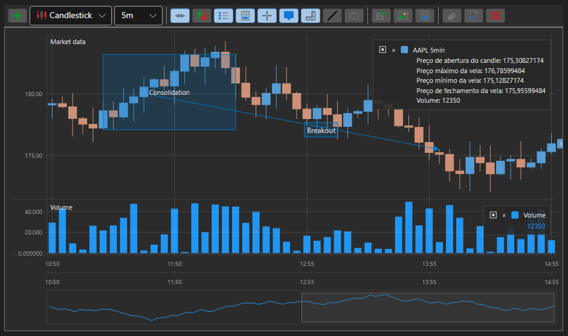
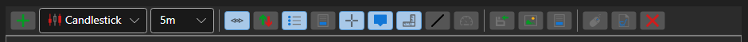

# Painel de gráfico de velas

[ChartPanel](xref:StockSharp.Xaml.Charting.ChartPanel) é um componente avançado para criar gráficos de bolsa, que tem uma barra de ferramentas e funcionalidade adicional. A técnica de construção de gráficos com [ChartPanel](xref:StockSharp.Xaml.Charting.ChartPanel) não difere significativamente da técnica com [Chart](candle_chart.md).

As figuras seguintes mostram a aparência do componente, bem como as funções dos botões da barra de ferramentas.

1 - Linha horizontal;

2 - Linha vertical;

3 - Dica;

4 - Linha de tendência;

5 - Área;

6 - Isto é um texto.

**Funcionalidade da barra de ferramentas**

1 - Adicionar painel;

2 - Ativar deslocamento automático;

3 - Ativar escalonamento automático;

4 - Ativar legenda;

5 - Ativar área de pré-visualização;

6 - Ativar cruz de mira;

7 - Ativar dica para barra;

8 - Mostrar valores no eixo;

9 - Desenhar linha de tendência;

10 - Desenhar ponteiro;

11 - Desenhar linha vertical;

12 - Desenhar linha horizontal;

13 - Selecionar área;

14 - Etiqueta de texto;

15 - Mostrar estatísticas de FPS;

16 - Registo de ordens;

17 - Guardar dados;

18 - Publicação;
