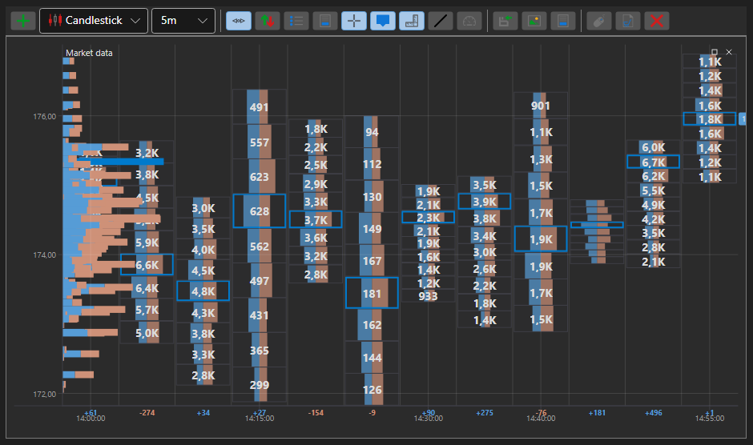

# Gráfico de clusters

ClusterChart - é um tipo especial de gráfico para apresentar volumes na forma de clusters com gráficos de barras. Para utilizar este tipo de gráfico, é necessário definir o estilo especial [IChartCandleElement.DrawStyle](xref:StockSharp.Charting.IChartCandleElement.DrawStyle) \= [ChartCandleDrawStyles.ClusterProfile](xref:StockSharp.Charting.ChartCandleDrawStyles.ClusterProfile). Este gráfico utiliza a informação da propriedade [PriceLevels](xref:StockSharp.Messages.CandleMessage.PriceLevels) como dados de origem.

**Propriedades principais**

- [ChartCandleElement.ClusterLineColor](xref:StockSharp.Xaml.Charting.ChartCandleElement.ClusterLineColor) - a cor base da linha do cluster.
- [ChartCandleElement.ClusterTextColor](xref:StockSharp.Xaml.Charting.ChartCandleElement.ClusterTextColor) - a cor dos valores de volume no gráfico.
- [ChartCandleElement.ClusterColor](xref:StockSharp.Xaml.Charting.ChartCandleElement.ClusterColor) - a cor principal das barras nos histogramas dos clusters.
- [ChartCandleElement.ClusterMaxColor](xref:StockSharp.Xaml.Charting.ChartCandleElement.ClusterMaxColor) - a cor da barra de volume máximo nos histogramas dos clusters.

Um exemplo de utilização deste tipo de gráfico está em *Samples\/Common\/SampleChart*.

> [!TIP]
> Para alternar entre os tipos de gráfico, utilize o botão de definições (engrenagem), localizado no canto superior esquerdo do gráfico.
