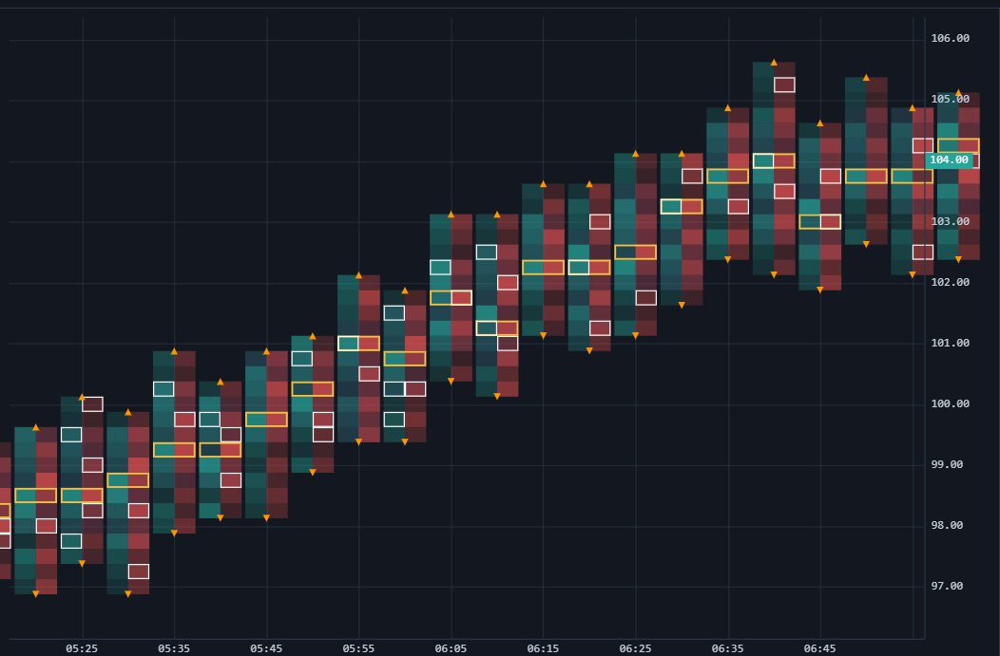

# Footprint

Um gráfico de footprint abre cada barra para mostrar o volume negociado em cada preço dentro dela, dividido em bid e ask. A coloração por desequilíbrio (imbalance) destaca onde compradores ou vendedores agressivos dominaram, o que é o cerne da leitura de order-flow.

## Demonstração em direto

Aproxime o zoom para ler as células individuais — o footprint só é legível com um punhado de barras por vez.

```chart-demo footprint
```



## Configuração

Adicione uma `FootprintSeries` e alimente-a com barras exatas de order-flow. Cada barra carrega `dataMode: 'exact'`, o respetivo OHLC e um array `levels` de `{ price, bidVolume, askVolume, tradeCount }`:

```js
const series = chart.addSeries(SSChart.FootprintSeries, {
  tickSize: 0.25,
  mode: SSChart.FootprintDisplayMode.BidAsk,       // modo de exibição: BidAsk | Delta | Total | Ladder
  detailLevel: SSChart.FootprintDetailLevel.Auto,  // nível de detalhe: Auto | Numbers | Heatmap | Summary
  bidColor: '#26a69a',
  askColor: '#ef5350',
  showUnfinishedAuctions: true,
});

series.setData(exactBars);
```

`mode` seleciona o que cada célula apresenta (bid × ask, delta, total ou uma escada); `detailLevel` troca o detalhe numérico pela densidade à medida que o gráfico é ampliado ou reduzido — `Auto` alterna automaticamente.

## Veja também

- [Gráficos em JavaScript](../javascript_charts.md)
- [Perfil de volume](volume_profile.md)
- [TPO (Perfil de mercado)](tpo.md)
