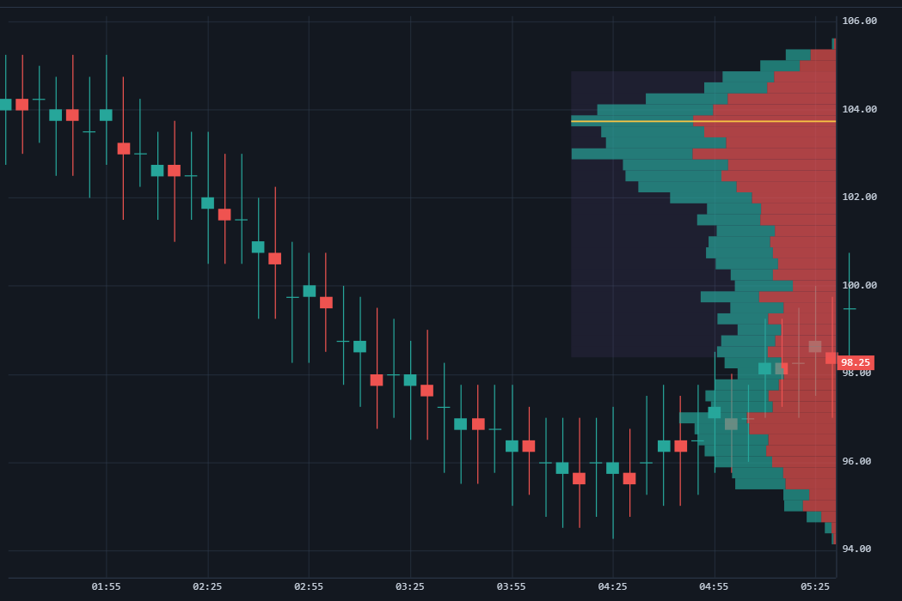

# Perfil de volume

Um perfil de volume agrega o volume negociado por preço e o desenha como um histograma horizontal, marcando o point of control (o preço mais negociado) e a value area. Ele responde "onde os negócios foram feitos", independentemente de quando.

## Demonstração ao vivo

O perfil é recalculado sobre quaisquer barras que estejam à vista — role e amplie para vê-lo mudar.

```chart-demo volume-profile
```



## Configuração

Adicione uma `ExactVolumeProfileSeries` (geralmente sobre uma série de velas para dar contexto) e alimente-a com as mesmas barras de order flow usadas pelo footprint:

```js
const candles = chart.addSeries(SSChart.CandlestickSeries, {
  upColor: '#26a69a', downColor: '#ef5350', borderVisible: false,
});
candles.setData(exactBars);

const profile = chart.addSeries(SSChart.ExactVolumeProfileSeries, {
  tickSize: 0.25,
  rangeMode: SSChart.VolumeProfileRangeMode.Visible,     // modo de intervalo: Visible | Fixed | Session
  displayMode: SSChart.VolumeProfileDisplayMode.BidAsk,  // modo de exibição: Total | BidAsk | Delta
  bidColor: '#26a69a',
  askColor: '#ef5350',
  showLabels: true,
  profileWidth: 0.32,
});
profile.setData(exactBars);

chart.timeScale().fitContent();
```

`rangeMode` define o que o perfil abrange: `Visible` recalcula sobre a área visível, `Fixed` fixa um intervalo, `Session` cria um perfil por sessão.

## Veja também

- [Gráficos em JavaScript](../javascript_charts.md)
- [Footprint](footprint.md)
- [TPO (Perfil de mercado)](tpo.md)
