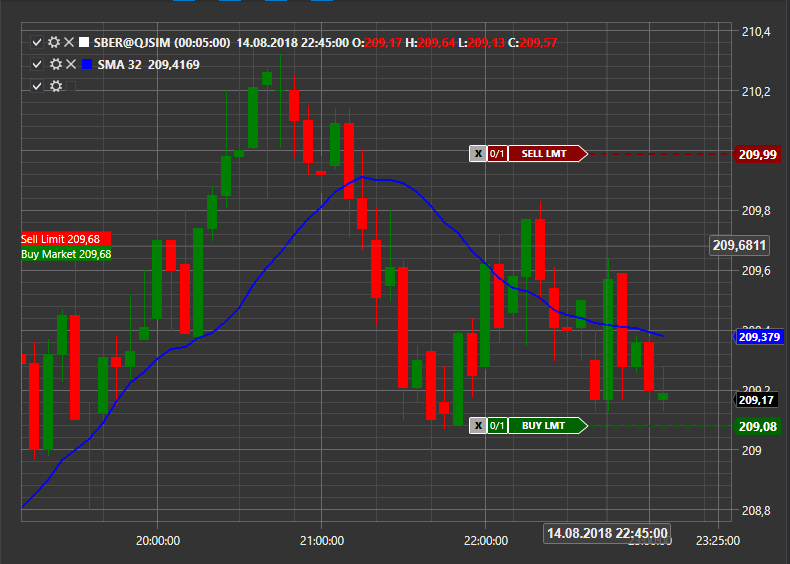

# Registo de ordens a partir do gráfico

S# permite registar ordens a partir do gráfico. Para ativar esta funcionalidade, é necessário definir a propriedade [Chart.OrderCreationMode](xref:StockSharp.Xaml.Charting.Chart.OrderCreationMode) como **"True"**; por predefinição, está desativada.



As ordens de compra serão registadas utilizando a combinação **Ctrl + Botão esquerdo do rato**.

As ordens de venda serão registadas utilizando a combinação **Ctrl + Botão direito do rato**.

A ordem resultante pode ser intercetada através do evento de criação de nova ordem.

```cs
ChartPanel.CreateOrder += (chartArea,order) =>
{
	order.Portfolio = _portfolio;
	order.Security = _security;
	order.Volume = 1;
	
	_connector.RegisterOrder(order);
};
```

As ordens registadas serão apresentadas como um elemento especial para apresentar ordens [ChartActiveOrdersElement](xref:StockSharp.Xaml.Charting.ChartActiveOrdersElement).
