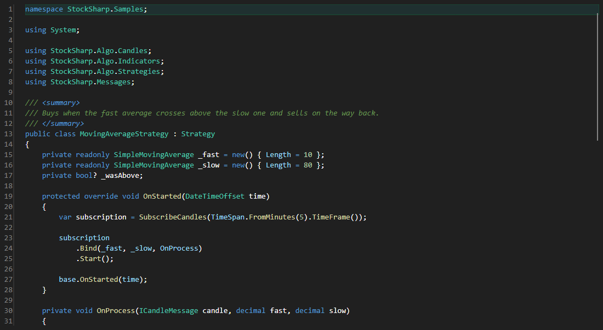

# Editor de código



[CodePanel](xref:StockSharp.Xaml.CodeEditor.CodePanel) - um editor de código-fonte com realce de sintaxe, numeração de linhas, autocompletar e uma barra de ferramentas de compilação. É usado onde o código é editado dentro da aplicação \- em estratégias, indicadores e scripts.

**Propriedades principais**

- [CodePanel.Code](xref:StockSharp.Xaml.CodeEditor.CodePanel.Code) - o código editado e seu estado de compilação.
- [CodePanel.ReadOnly](xref:StockSharp.Xaml.CodeEditor.CodePanel.ReadOnly) - proibição de alterar o texto.
- [CodePanel.ShowToolBar](xref:StockSharp.Xaml.CodeEditor.CodePanel.ShowToolBar) - exibição da barra de ferramentas.
- [CodePanel.AutoCompile](xref:StockSharp.Xaml.CodeEditor.CodePanel.AutoCompile) - compilação automática após uma edição.

O editor não mostra os erros de compilação por conta própria \- é conveniente exibi-los ao lado na tabela [ErrorsGrid](xref:StockSharp.Xaml.Code.ErrorsGrid) e saltar para a linha com duplo clique.

Abaixo estão fragmentos de código com seu uso:

```xaml
<Window x:Class="Sample.CodeWindow"
	xmlns="http://schemas.microsoft.com/winfx/2006/xaml/presentation"
	xmlns:x="http://schemas.microsoft.com/winfx/2006/xaml"
	xmlns:code="clr-namespace:StockSharp.Xaml.CodeEditor;assembly=StockSharp.Xaml.CodeEditor"
	Height="600" Width="900">
	<code:CodePanel x:Name="CodePanel" ShowToolBar="True" />
</Window>
```

```cs
// Carregamos o texto-fonte no editor
CodePanel.Code = new CodeInfo
{
	Text = File.ReadAllText("MyStrategy.cs"),
};

// Após a compilação mostramos os erros em uma tabela separada
CodePanel.CompiledCode += () => ErrorsGrid.Errors.AddRange(CodePanel.Code.Errors);

// Visualização sem edição
CodePanel.ReadOnly = true;
```

## Veja também

[Diagnóstico](../diagnostics.md)
