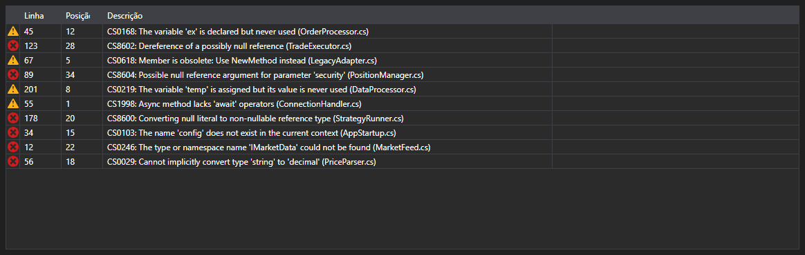

# Erros de compilação



[ErrorsGrid](xref:StockSharp.Xaml.Code.ErrorsGrid) - uma tabela de erros de compilação. Para cada entrada [CompilationError](xref:Ecng.Compilation.CompilationError) mostra o tipo (erro, aviso, mensagem), a linha, a posição na linha e o texto.

**Propriedades principais**

- [ErrorsGrid.Errors](xref:StockSharp.Xaml.Code.ErrorsGrid.Errors) - lista de erros de compilação.

O evento `ErrorSelected` é disparado ao dar duplo clique em uma linha \- o editor de código move o cursor para essa linha. Assim a tabela e o editor formam o par habitual de lista de erros e salto até o local do erro.

Abaixo estão fragmentos de código com seu uso:

```xaml
<Window x:Class="Sample.CompilationWindow"
	xmlns="http://schemas.microsoft.com/winfx/2006/xaml/presentation"
	xmlns:x="http://schemas.microsoft.com/winfx/2006/xaml"
	xmlns:code="clr-namespace:StockSharp.Xaml.Code;assembly=StockSharp.Xaml"
	Height="200" Width="800">
	<code:ErrorsGrid x:Name="ErrorsGrid" />
</Window>
```

```cs
// Mostramos o resultado da compilação
var result = compiler.Compile("Strategy", sources, references);

ErrorsGrid.Errors.Clear();
ErrorsGrid.Errors.AddRange(result.Errors);

// Com duplo clique saltamos para a linha do erro
ErrorsGrid.ErrorSelected += error => CodePanel.Code.SelectLine(error.Line);
```

## Veja também

[Diagnóstico](../diagnostics.md)
