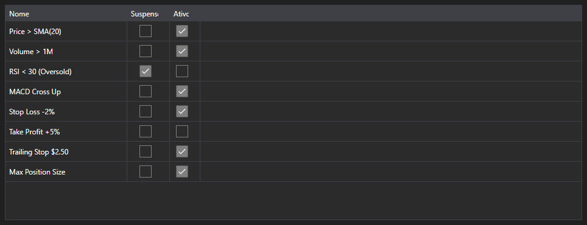

# Regras ativas



[MarketRuleGrid](xref:StockSharp.Xaml.MarketRuleGrid) - uma tabela de regras [IMarketRule](xref:StockSharp.Algo.IMarketRule) criadas por uma estratégia ou um conector. Mostra o nome da regra e os indicadores de suspensão e de atividade.

**Propriedades principais**

- [MarketRuleGrid.Rules](xref:StockSharp.Xaml.MarketRuleGrid.Rules) - lista de regras; normalmente [Strategy.Rules](xref:StockSharp.Algo.Strategies.Strategy.Rules).

A tabela é útil quando há muitas regras e é preciso saber quais ainda estão vivas. Uma regra some da lista quando dispara e é removida, então um vazamento aparece na hora: uma regra que deveria ter sido removida mas permaneceu.

Abaixo estão fragmentos de código com seu uso:

```xaml
<Window x:Class="Sample.RulesWindow"
	xmlns="http://schemas.microsoft.com/winfx/2006/xaml/presentation"
	xmlns:x="http://schemas.microsoft.com/winfx/2006/xaml"
	xmlns:xaml="http://schemas.stocksharp.com/xaml"
	Height="300" Width="600">
	<xaml:MarketRuleGrid x:Name="RuleGrid" />
</Window>
```

```cs
// Mostramos as regras da estratégia
RuleGrid.Rules = _strategy.Rules;

// Cada regra criada aparece na tabela
_strategy
	.WhenPositionChanged()
	.Do(() => LogInfo("position={0}", _strategy.Position))
	.Apply(_strategy);
```

## Veja também

[Diagnóstico](../diagnostics.md)
