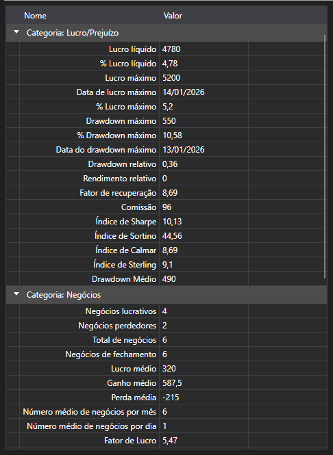

# Estatísticas da estratégia



[StatisticParameterGrid](xref:StockSharp.Xaml.StatisticParameterGrid) - uma tabela dos parâmetros estatísticos [IStatisticParameter](xref:StockSharp.Algo.Statistics.IStatisticParameter) de uma única estratégia. Os parâmetros estão agrupados por categorias (negócios, ordens, rentabilidade, drawdown) e, em cada linha, ficam o nome, o valor atual e a descrição.

**Propriedades e métodos principais**

- [StatisticParameterGrid.StatisticManager](xref:StockSharp.Xaml.StatisticParameterGrid.StatisticManager) - o gestor de estatísticas cujos parâmetros a tabela mostra. Normalmente é [Strategy.StatisticManager](xref:StockSharp.Algo.Strategies.Strategy.StatisticManager).
- [StatisticParameterGrid.Parameters](xref:StockSharp.Xaml.StatisticParameterGrid.Parameters) - a lista de parâmetros, quando é definida diretamente e não pelo gestor.
- [StatisticParameterGrid.Reset](xref:StockSharp.Xaml.StatisticParameterGrid.Reset) - repõe os valores acumulados.

Os valores são atualizados ao longo do funcionamento da estratégia, por isso a tabela fica ao lado do gráfico: o gráfico mostra como correu a negociação e a tabela, quanto ela custou. Ao repetir o mesmo cálculo é preciso chamar `Reset`, caso contrário os novos valores ficam sobre os antigos.

Ao contrário de [StrategiesStatisticsPanel](xref:StockSharp.Xaml.StrategiesStatisticsPanel), que compara várias estratégias pelas mesmas colunas, esta tabela detalha uma única estratégia por inteiro.

Abaixo estão fragmentos de código com seu uso:

```xaml
<Window x:Class="Sample.StatisticsWindow"
	xmlns="http://schemas.microsoft.com/winfx/2006/xaml/presentation"
	xmlns:x="http://schemas.microsoft.com/winfx/2006/xaml"
	xmlns:xaml="http://schemas.stocksharp.com/xaml"
	Height="500" Width="400">
	<xaml:StatisticParameterGrid x:Name="StatisticGrid" />
</Window>
```

```cs
// Mostramos as estatísticas da estratégia
StatisticGrid.StatisticManager = _strategy.StatisticManager;

// Antes de uma nova execução repomos os valores acumulados
StatisticGrid.Reset();
```

## Veja também

[Diagnóstico](../diagnostics.md)

[Estatísticas](../strategies/statistics.md)
