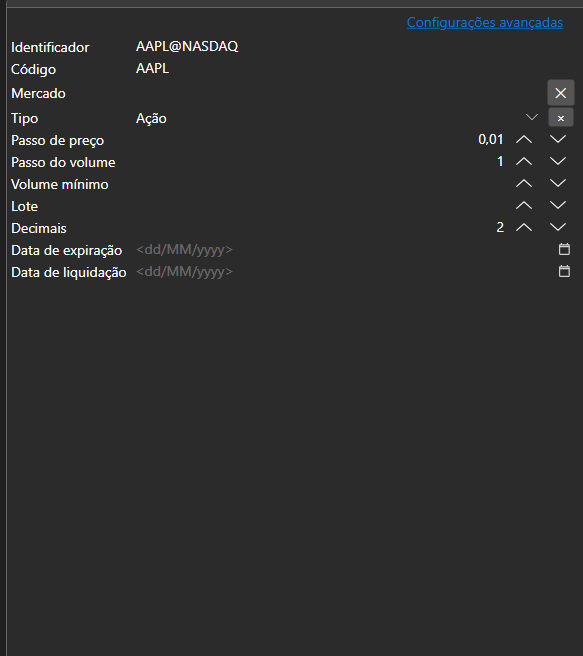
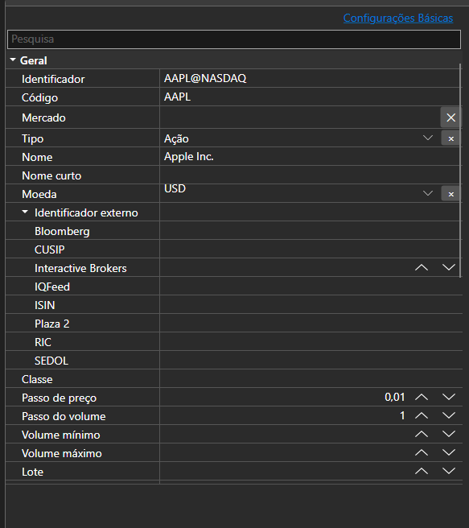

# Propriedades básicas e avançadas





[BasicAdvPropertiesPanel](xref:StockSharp.Xaml.PropertyGrid.BasicAdvPropertiesPanel) - um painel de propriedades com dois modos. O modo básico mostra uma lista curta de campos obrigatórios e o avançado todas as propriedades do objeto agrupadas por categorias.

**Propriedades principais**

- [BasicAdvPropertiesPanel.SelectedObject](xref:StockSharp.Xaml.PropertyGrid.BasicAdvPropertiesPanel.SelectedObject) - objeto editado.
- [BasicAdvPropertiesPanel.IsAdvancedMode](xref:StockSharp.Xaml.PropertyGrid.BasicAdvPropertiesPanel.IsAdvancedMode) - indicador do modo avançado.
- [BasicAdvPropertiesPanel.PlainMaxDepth](xref:StockSharp.Xaml.PropertyGrid.BasicAdvPropertiesPanel.PlainMaxDepth) - profundidade de expansão das propriedades aninhadas no modo básico.
- [BasicAdvPropertiesPanel.PostImmediately](xref:StockSharp.Xaml.PropertyGrid.BasicAdvPropertiesPanel.PostImmediately) - aplicar o valor já durante a digitação, sem esperar a saída do campo.

Os dois modos resolvem o problema habitual das configurações do conector: há três ou quatro campos obrigatórios e várias dezenas de propriedades no total. O modo básico mostra apenas o que é indispensável para a conexão funcionar; o restante continua disponível no modo avançado.

Abaixo estão fragmentos de código com seu uso:

```xaml
<Window x:Class="Sample.SettingsWindow"
	xmlns="http://schemas.microsoft.com/winfx/2006/xaml/presentation"
	xmlns:x="http://schemas.microsoft.com/winfx/2006/xaml"
	xmlns:pg="clr-namespace:StockSharp.Xaml.PropertyGrid;assembly=StockSharp.Xaml"
	Height="500" Width="400">
	<pg:BasicAdvPropertiesPanel x:Name="PropertiesPanel" />
</Window>
```

```cs
// Mostramos as propriedades do adaptador
PropertiesPanel.SelectedObject = _adapter;

// Mudamos para o modo avançado
PropertiesPanel.IsAdvancedMode = true;

// Marcamos que as configurações mudaram
PropertiesPanel.CellValueChanged += (sender, e) => _isModified = true;
```

## Veja também

[Editores de valores](../editors.md)
