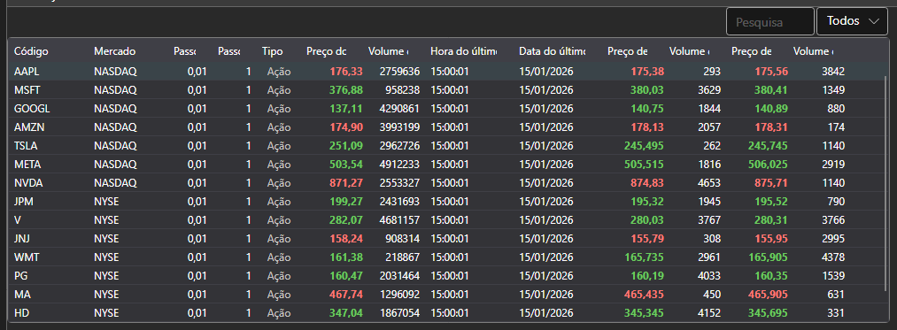

# Tabela

O componente [SecurityGrid](xref:StockSharp.Xaml.SecurityGrid) foi concebido para apresentar informação financeira (campos Level1) e as respetivas alterações relacionadas com instrumentos em formato tabular. O componente permite selecionar um ou mais instrumentos.



**Propriedades principais**

- [SecurityGrid.Securities](xref:StockSharp.Xaml.SecurityGrid.Securities) - a lista de instrumentos.
- [SecurityGrid.SelectedSecurity](xref:StockSharp.Xaml.SecurityGrid.SelectedSecurity) - o instrumento selecionado.
- [SecurityGrid.SelectedSecurities](xref:StockSharp.Xaml.SecurityGrid.SelectedSecurities) - a lista de instrumentos selecionados.
- [SecurityGrid.MarketDataProvider](xref:StockSharp.Xaml.SecurityGrid.MarketDataProvider) - o fornecedor de dados de mercado.

Tenha em atenção que, para apresentar alterações na informação de mercado, deve especificar um fornecedor de dados de mercado.

Abaixo está um excerto de código com a sua utilização.

Na figura, o componente [SecurityGrid](xref:StockSharp.Xaml.SecurityGrid) é mostrado no componente gráfico [SecurityPicker](picker.md).

```xaml
<Window x:Class="SecurityGridSample.MainWindow"
		xmlns="http://schemas.microsoft.com/winfx/2006/xaml/presentation"
		xmlns:x="http://schemas.microsoft.com/winfx/2006/xaml"
		xmlns:sx="clr-namespace:StockSharp.Xaml;assembly=StockSharp.Xaml"
		Title="MainWindow" Height="350" Width="525">
	<Grid>
		<sx:SecurityGrid x:Name="SecurityGrid"/>
	</Grid>
</Window>
	  				
```
```cs
private readonly Connector _connector = new Connector();
SecurityGrid.MarketDataProvider = _connector;
..........................
_connector.SecurityReceived += (sub, security) =>
{
	SecurityGrid.Securities.Add(security);
};
..........................
private void ColumnsFilter()
{
	string[]  columns = { "Board", "BestAsk.Price", "BestAsk.Volume" };
	
	foreach (var column in SecurityGrid.Columns)
	{
		column.Visibility = columns.Contains(column.SortMemberPath) ? Visibility.Visible : Visibility.Collapsed;
	}
}
				
```
