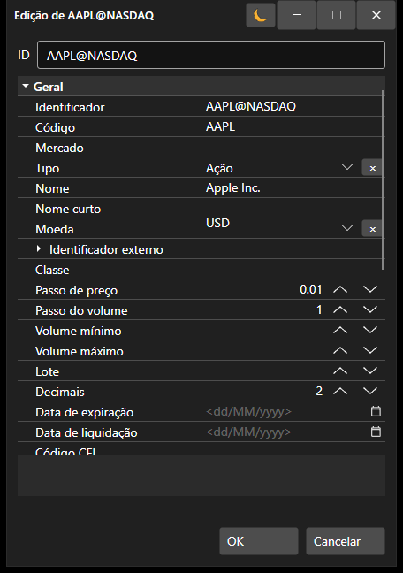

# Janela

O componente [SecurityCreateWindow](xref:StockSharp.Xaml.SecurityCreateWindow) é uma janela para criar e editar um instrumento. O componente é composto por dois elementos principais: o campo de texto especial [SecurityIdTextBox](xref:StockSharp.Xaml.SecurityIdTextBox) e a grelha de edição de propriedades [PropertyGridEx](xref:StockSharp.Xaml.PropertyGrid.PropertyGridEx). Pode aceder ao instrumento criado (editado) através da propriedade [SecurityCreateWindow.Security](xref:StockSharp.Xaml.SecurityCreateWindow.Security).

Abaixo é apresentado o aspeto do componente e um excerto de código com a sua utilização.



```cs
private void Button_Click(object sender, RoutedEventArgs e)
{
	var dlg = new SecurityCreateWindow();
	var result = dlg.ShowDialog();
	if (result != null && (bool)result)
	{
		var security = dlg.Security;
	}
}
	
```
