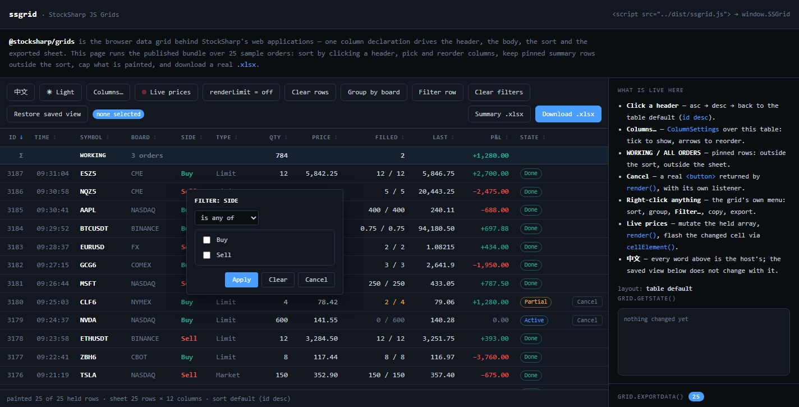

# DataGrid

`DataGrid<TRow>` constrói uma tabela para navegador a partir de uma matriz de declarações `GridColumn<TRow>`. Cada declaração define o cabeçalho, o valor apresentado, a ordenação, a filtragem, a classe CSS e o valor para exportação, pelo que estas representações permanecem sincronizadas quando o conjunto de colunas é alterado.

## Criação da tabela

`DataGrid` limpa os elementos `head` e `body` fornecidos e passa a gerir o respetivo conteúdo. As duas secções devem existir na marcação:

```html
<table id="orders" class="orders-grid">
  <thead></thead>
  <tbody></tbody>
</table>
```

```ts
import {
  DataGrid,
  GridPinnedPlacements,
  SortDirections,
} from '@stocksharp/grids';

interface Order {
  id: number;
  symbol: string;
  side: 'buy' | 'sell';
  price: number;
  volume: number;
  mercado: string;
}

const table = document.querySelector<HTMLTableElement>('#orders')!;
const grid = new DataGrid<Order>({
  head: table.tHead!,
  body: table.tBodies[0],
  columns: [
    { key: 'id', header: 'N.º', value: order => order.id, filter: 'number', exportable: true },
    { key: 'symbol', header: 'Instrumento', value: order => order.symbol, filter: 'text', exportable: true },
    {
      key: 'side',
      header: 'Direção',
      value: order => order.side,
      text: order => order.side === 'buy' ? 'Compra' : 'Venda',
      render: order => order.side === 'buy' ? 'Compra' : 'Venda',
      cellClass: order => order.side === 'buy' ? 'side-buy' : 'side-sell',
      exportValue: order => order.side === 'buy' ? 'Compra' : 'Venda',
      filter: 'set',
      exportable: true,
    },
    { key: 'price', header: 'Preço', value: order => order.price, filter: 'number', exportable: true },
    { key: 'volume', header: 'Volume', value: order => order.volume, filter: 'number', exportable: true },
    { key: 'mercado', header: 'Praça de negociação', value: order => order.mercado, filter: 'set', exportable: true },
  ],
  defaultSort: { col: 'id', dir: SortDirections.Desc },
  rowKey: order => String(order.id),
  emptyText: 'Sem ordens',
  locale: 'pt-PT',
  reorderable: true,
  filtersVisible: true,
  selection: 'multi',
  selectedClass: 'is-selected',
  contextMenu: true,
  pinnedRows: () => [{
    key: 'total',
    className: 'grid-total',
    place: GridPinnedPlacements.Bottom,
    cells: [
      { content: '', className: '' },
      { content: 'Total', className: 'grid-total-label' },
      { content: '', className: '' },
      { content: '', className: '' },
      { content: '150', className: 'grid-total-value' },
      { content: '', className: '' },
    ],
  }],
});

const orders: Order[] = [
  { id: 101, symbol: 'SBER', side: 'buy', price: 312.45, volume: 100, mercado: 'TQBR' },
  { id: 102, symbol: 'GAZP', side: 'sell', price: 164.18, volume: 50, mercado: 'TQBR' },
];

grid.setRows(orders);
```

`rowKey` deve devolver uma chave única e estável. A tabela utiliza-a para preservar a seleção depois de voltar a ser apresentada e para encontrar elementos através de `rowElement()` e `cellElement()`.

## Descrição da coluna

Principais campos de `GridColumn<TRow>`:

- `key` — identificador permanente da coluna;
- `header` — cabeçalho já localizado;
- `value(row)` — valor para ordenação e, por predefinição, para apresentação e exportação;
- `render(row)` — cadeia ou nó DOM da célula;
- `text(row)` — representação textual do valor para grupos, filtro por conjunto e menu de contexto;
- `cellClass(row)` e `bindCell(td, row)` — estilo e processadores da célula;
- `filter` — tipo de filtro: `text`, `number` ou `set`;
- `exportable` e `exportValue(row)` — inclusão da coluna e valor separado para `.xlsx`.

Se `render()` devolver um `Node` ou `DocumentFragment`, o componente adiciona-o à célula como DOM e não como uma cadeia HTML. Isso permite criar botões em segurança e atribuir-lhes processadores através de `addEventListener`.

## Ordenação, filtros e agrupamento

Um clique no cabeçalho alterna a ordenação no ciclo «ascendente → descendente → ordem predefinida». Os valores vazios permanecem no fim nos dois sentidos. A comparação do texto é efetuada por `Intl.Collator` para o idioma de `locale`; se o parâmetro não for indicado, é utilizado o idioma do documento.

Os filtros rápidos são apresentados numa linha sob os cabeçalhos quando é definido `filtersVisible: true`. A interface programática aceita objetos serializáveis:

```ts
grid.setFilter('symbol', { op: 'startsWith', text: 'SB' });
grid.setFilter('price', { op: 'between', min: 300, max: 320 });
grid.setFilter('mercado', { op: 'anyOf', values: ['TQBR', 'TQTF'] });

const rowsAfterFilters = grid.filteredRows();
grid.clearFilters();
```

Estão disponíveis as operações `contains`, `notContains`, `startsWith`, `endsWith`, `eq`, `ne`, `gt`, `ge`, `lt`, `le`, `between`, `anyOf`, `noneOf`, `empty` e `notEmpty`. Um objeto de filtro vazio equivale à ausência de filtro.

O agrupamento suporta um nível. As linhas dentro do grupo mantêm a ordenação selecionada e os grupos podem ser recolhidos:

```ts
grid.groupBy('mercado');
grid.toggleGroup('TQBR');
grid.groupBy(null);
```

## Menu de contexto e caixa de diálogo do filtro


Com `contextMenu: true`, o `GridContextMenu` incorporado oferece ordenação, agrupamento, filtragem por valor, ocultação e reposição de colunas, cópia de célula ou linha e exportação `.xlsx`. O objeto `contextMenu` permite alterar as classes CSS, as legendas e a lista de ações:

```ts
contextMenu: {
  classes: { menu: 'orders-menu', item: 'orders-menu-item' },
  labels: {
    sortAsc: 'Ordem ascendente',
    sortDesc: 'Ordem descendente',
    filterRule: 'Configurar filtro…',
    filterByValue: value => `Manter o valor: ${value}`,
  },
  items: (context, defaults) => context.row
    ? [
        {
          label: `Cancelar a ordem n.º ${context.row.id}`,
          run: () => cancelOrder(context.row!.id),
        },
        {},
        ...defaults,
      ]
    : defaults,
}
```

Os campos de `labels` são parciais: as legendas não indicadas conservam os valores ingleses predefinidos. Para uma interface totalmente portuguesa, a aplicação deve fornecer todas as legendas visíveis de `GridMenuLabels` e `GridFilterDialogLabels`.



`GridFilterDialog` é aberto a partir do menu ou através do método `openFilterDialog(key, x, y)`. Ao contrário da linha de filtro rápido, permite selecionar o operador e o respetivo operando. Para o filtro `set`, a caixa de diálogo apresenta a lista de valores que estão realmente presentes. Em cada momento, não pode estar aberto na página mais de um menu de contexto e uma caixa de diálogo incorporados.

Os componentes do menu e da caixa de diálogo criam a marcação e atribuem nomes de classes, mas não incluem um estilo pronto. A aplicação deve definir as classes padrão `grid-menu*` e `grid-filter-dialog*` ou fornecer as suas através de `classes`.

As classes de baixo nível também são exportadas pelo pacote. `GridContextMenu.open(items, x, y)` apresenta uma matriz de `GridMenuItem`, na qual um objeto vazio serve de separador, `disabled` desativa a ação e `checked` assinala a opção. `GridFilterDialog.open(options, commit)` obtém o cabeçalho da coluna em `options.header` e recebe também o tipo de filtro, a condição atual, as opções de valores e as coordenadas; a função `commit` recebe o novo `GridFilter` ou `null` ao limpar. Ambas as classes têm a propriedade `isOpen` e o método `close()`. Normalmente, não é necessário criá-las manualmente: `DataGrid` gere-as através do parâmetro `contextMenu` e do método `openFilterDialog()`.

## Estado e seleção de linhas

`getState()` devolve um objeto comum compatível com JSON, contendo a ordem e as colunas ocultas, a ordenação, os filtros, o agrupamento, os grupos recolhidos e a visibilidade do cabeçalho e da linha de filtros:

```ts
const grid = new DataGrid<Order>({
  // outros parâmetros
  onStateChange: state => {
    localStorage.setItem('orders-grid', JSON.stringify(state));
  },
});

const saved = localStorage.getItem('orders-grid');
if (saved)
  grid.setState(JSON.parse(saved));
```

As chaves de colunas desconhecidas são ignoradas ao restaurar e as novas colunas ausentes da ordem guardada são acrescentadas depois das que estão enumeradas. `setState()` não chama `onStateChange`, pelo que o carregamento não volta a guardar o estado.

A seleção de linhas não faz parte de `GridState`. Se precisar de a restaurar, guarde separadamente as chaves de `onSelectionChange` e forneça-as a `setSelection(keys)`.

## Dados em tempo real e exportação

`setRows(rows)` substitui o conjunto de linhas e volta a apresentar a tabela. O componente conserva uma referência à matriz fornecida, pelo que pode chamar `render()` depois de alterar os objetos. Para uma atualização pontual, utilize `cellElement(rowKey, columnKey)` e, para encontrar uma linha, `rowElement(rowKey)`.

`renderLimit` limita apenas o número de linhas no DOM. A filtragem, a ordenação e a exportação continuam a abranger todo o conjunto. `afterRender()` é chamado depois de cada apresentação subsequente e é adequado, por exemplo, para renovar as subscrições dos instrumentos atualmente visíveis.

As linhas fixas de `pinnedRows()` são lidas novamente em cada apresentação e não participam na ordenação, na seleção nem na exportação. O método `exportData()` devolve os cabeçalhos e as linhas sem transferir um ficheiro, enquanto `download(baseName, sheetName)` cria o `.xlsx`.

## Localização e destruição da instância


O pacote não traduz automaticamente os cabeçalhos e os valores. A aplicação fornece `header`, `emptyText`, `text`, `groupHeader`, bem como as legendas do menu e da caixa de diálogo já localizados. O estado guarda as chaves e os valores originais, pelo que pode ser transferido para uma nova instância depois da mudança de idioma.

Antes de substituir uma instância, chame `destroy()`. O método remove do documento o processador de `Ctrl+C` e fecha os menus e as caixas de diálogo abertos:

```ts
const state = grid.getState();
grid.destroy();

const localizedGrid = createPortugueseGrid();
localizedGrid.setState(state);
```

## Consulte também

- [Tabelas JavaScript](../javascript_grids.md)
- [TableSort](table_sort.md)
- [TableExport](table_export.md)
- [ColumnSettings](column_settings.md)
- [Demonstração online de JS-Grids](https://stocksharp.github.io/JS-Grids/demo/)
