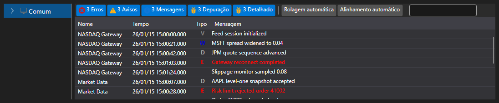

# Painel de log alargado

[Monitor](xref:StockSharp.Xaml.Monitor) - é o elemento visual onde [LogControl](log_panel.md) é utilizado em conjunto com a árvore hierárquica **TreeView**, na qual são apresentadas as fontes de log. Inicialmente, o componente foi concebido para monitorizar estratégias de negociação. Por isso, por predefinição, a "árvore" inclui o nó **Estratégia**. Ao mesmo tempo, podem ser utilizadas outras fontes com este componente.



Código de exemplo

```xaml
<Window x:Class="LoggingControls.MainWindow"
		xmlns="http://schemas.microsoft.com/winfx/2006/xaml/presentation"
		xmlns:x="http://schemas.microsoft.com/winfx/2006/xaml"
		xmlns:sx="clr-namespace:StockSharp.Xaml;assembly=StockSharp.Xaml"
		Title="MainWindow" Height="350" Width="525">
	<Grid>
		<sx:Monitor x:Name="Monitor" />
	</Grid>
</Window>
				
```
```cs
// criar nova instância de LogManager
_logManager = new LogManager();
// adicionar .NET tracing como fonte de log.
_logManager.Sources.Add(new Ecng.Logging.TraceSource());
// adicionar Monitor como listener de log.
_logManager.Listeners.Add(new GuiLogListener(Monitor));
					
```
