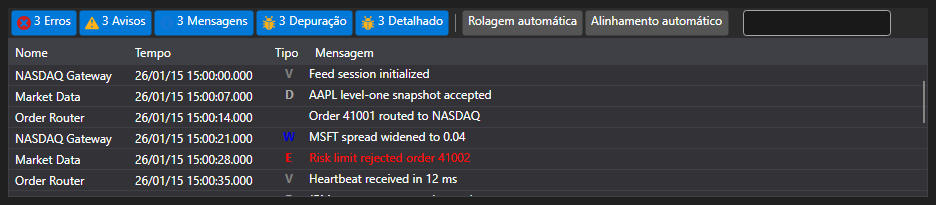

# Painel de registo

[LogControl](xref:StockSharp.Xaml.LogControl) - a tabela para apresentar mensagens de registo. Os botões da barra de ferramentas permitem filtrar mensagens com diferentes níveis de registo.

## LogControl



Código de exemplo

```xaml
<Window x:Class="LoggingControls.MainWindow"
		xmlns="http://schemas.microsoft.com/winfx/2006/xaml/presentation"
		xmlns:x="http://schemas.microsoft.com/winfx/2006/xaml"
		xmlns:sx="clr-namespace:StockSharp.Xaml;assembly=StockSharp.Xaml"
		Title="MainWindow" Height="350" Width="525">
	<Grid>
		<sx:LogControl x:Name="LogControl"/>
	</Grid>
</Window>
	  				
```
```cs
// criar nova instância de LogManager
_logManager = new LogManager();
// adicionar .NET tracing como fonte de registo.
_logManager.Sources.Add(new Ecng.Logging.TraceSource());
// adicionar LogControl como ouvinte de registo.
_logManager.Listeners.Add(new GuiLogListener(LogControl));
..........................                  
// enviar mensagens de teste do TraceSource:
Trace.TraceInformation("Mensagem de teste de informação");
Trace.TraceWarning("Mensagem de teste de aviso");
Trace.TraceError("Mensagem de teste de erro");
					
```
