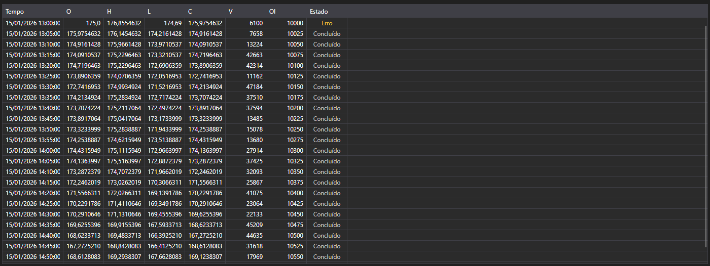

# Velas



[CandleMessageGrid](xref:StockSharp.Xaml.CandleMessageGrid) - uma tabela de velas. Mostra os preços de abertura, máxima, mínima e fechamento, os volumes, o open interest e o estado de cada vela.

**Principais propriedades**

- [CandleMessageGrid.Messages](xref:StockSharp.Xaml.CandleMessageGrid.Messages) - lista de velas.
- [CandleMessageGrid.SelectedMessage](xref:StockSharp.Xaml.CandleMessageGrid.SelectedMessage) - vela selecionada.
- [CandleMessageGrid.SelectedMessages](xref:StockSharp.Xaml.CandleMessageGrid.SelectedMessages) - velas selecionadas.

## Estados da vela

A coluna **State** é colorida pelo valor de [CandleStates](xref:StockSharp.Messages.CandleStates), e a captura mostra os três:

- **Active** - a vela ainda está se formando. Fica destacada porque seus valores continuam mudando: não deve ser lida como uma vela fechada.
- **Finished** - a vela está fechada e seus valores são definitivos. Cor neutra, e a maioria das linhas da tabela é assim.
- **None** - nenhum estado chegou. A tabela rotula como **Erro** e colore como aviso: não é um valor vazio, e sim o sinal de que os dados chegaram incompletos.

Portanto, uma assinatura de velas que mostra **Erro** na primeira linha está relatando um problema da fonte de dados, não uma vela sem estado.

Abaixo estão fragmentos de código demonstrando seu uso:

```xaml
<Window x:Class="Sample.CandlesWindow"
	xmlns="http://schemas.microsoft.com/winfx/2006/xaml/presentation"
	xmlns:x="http://schemas.microsoft.com/winfx/2006/xaml"
	xmlns:xaml="http://schemas.stocksharp.com/xaml"
	Title="Velas" Height="400" Width="800">
	<xaml:CandleMessageGrid x:Name="CandleGrid" x:FieldModifier="public" />
</Window>
```

```cs
public class CandlesWindow
{
	private readonly Connector _connector;
	private readonly Security _security;
	private Subscription _candleSubscription;

	public CandlesWindow(Connector connector, Security security)
	{
		InitializeComponent();

		_connector = connector;
		_security = security;

		// Assinar o evento de recebimento de velas
		_connector.CandleReceived += OnCandleReceived;

		// Criar uma assinatura de velas de cinco minutos
		_candleSubscription = new Subscription(TimeSpan.FromMinutes(5).TimeFrame(), security);

		// Iniciar a assinatura
		_connector.Subscribe(_candleSubscription);
	}

	// Manipulador de vela recebida
	private void OnCandleReceived(Subscription subscription, ICandleMessage candle)
	{
		// Verificar se a vela pertence à nossa assinatura
		if (subscription != _candleSubscription)
			return;

		// Adicionar a vela à tabela na thread da interface
		this.GuiAsync(() => CandleGrid.Messages.Add((CandleMessage)candle));
	}

	// Cancelar a assinatura ao fechar a janela
	public void Unsubscribe()
	{
		if (_candleSubscription != null)
		{
			_connector.CandleReceived -= OnCandleReceived;
			_connector.UnSubscribe(_candleSubscription);
			_candleSubscription = null;
		}
	}
}
```

### Somente velas finalizadas

Até fechar, uma vela chega muitas vezes, então a tabela cresce a cada atualização. Quando só os valores finais importam, filtre pelo estado:

```cs
private void OnCandleReceived(Subscription subscription, ICandleMessage candle)
{
	if (subscription != _candleSubscription)
		return;

	// Ignorar tudo o que ainda está se formando
	if (candle.State != CandleStates.Finished)
		return;

	this.GuiAsync(() => CandleGrid.Messages.Add((CandleMessage)candle));
}
```

### Atualizar a vela atual no lugar

Para manter a vela atual na tabela e atualizá-la em vez de adicioná-la novamente, substitua a última linha até a vela fechar:

```cs
private void OnCandleReceived(Subscription subscription, ICandleMessage candle)
{
	if (subscription != _candleSubscription)
		return;

	var message = (CandleMessage)candle;

	this.GuiAsync(() =>
	{
		var last = CandleGrid.Messages.LastOrDefault();

		// A mesma vela da última linha - substitui
		if (last != null && last.OpenTime == message.OpenTime)
			CandleGrid.Messages[CandleGrid.Messages.Count - 1] = message;
		else
			CandleGrid.Messages.Add(message);
	});
}
```

### Carregando velas históricas

```cs
// Carregar velas históricas
public void LoadHistoricalCandles(Security security, TimeSpan timeFrame, DateTime from, DateTime to)
{
	// Limpar as velas atuais
	CandleGrid.Messages.Clear();

	// Criar uma assinatura de velas históricas
	var historySubscription = new Subscription(timeFrame.TimeFrame(), security)
	{
		MarketData =
		{
			// Indicar o período dos dados históricos
			From = from,
			To = to
		}
	};

	_connector.CandleReceived += OnCandleReceived;
	_connector.Subscribe(historySubscription);
}
```

## Veja também

[Negócios tick](ticks.md)
