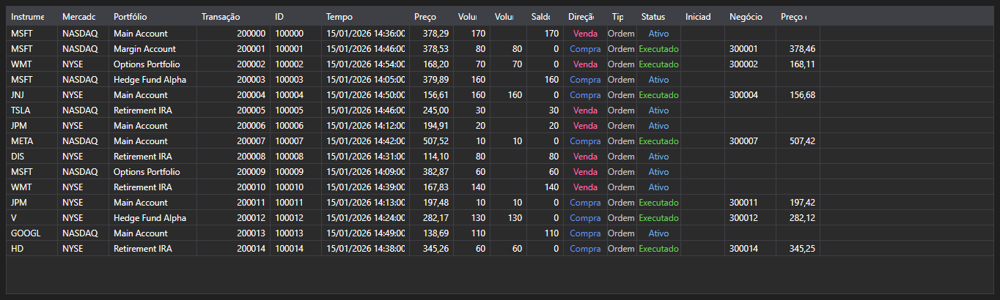

# Transações e negócios



[ExecutionGrid](xref:StockSharp.Xaml.ExecutionGrid) - uma tabela universal de mensagens [ExecutionMessage](xref:StockSharp.Messages.ExecutionMessage). Um único controle mostra ticks, registro de ordens e transações próprias \- o tipo de dados é definido por [ExecutionMessage.DataTypeEx](xref:StockSharp.Messages.ExecutionMessage.DataTypeEx).

**Propriedades principais**

- [ExecutionGrid.Messages](xref:StockSharp.Xaml.ExecutionGrid.Messages) - lista de mensagens.
- [ExecutionGrid.SelectedMessage](xref:StockSharp.Xaml.ExecutionGrid.SelectedMessage) - mensagem selecionada.
- [ExecutionGrid.SelectedMessages](xref:StockSharp.Xaml.ExecutionGrid.SelectedMessages) - mensagens selecionadas.
- [ExecutionGrid.MaxCount](xref:StockSharp.Xaml.ExecutionGrid.MaxCount) - número máximo de linhas da tabela; ao ser excedido as linhas mais antigas são removidas.

Como a mesma tabela atende três tipos de dados, as colunas desnecessárias são ocultadas por [ExecutionGrid.HideColumns](xref:StockSharp.Xaml.ExecutionGrid.HideColumns(StockSharp.Messages.DataType)): ticks não precisam das colunas de ordens, o registro de ordens não precisa das colunas de negócios próprios.

Abaixo estão fragmentos de código com seu uso:

```xaml
<Window x:Class="Sample.ExecutionsWindow"
	xmlns="http://schemas.microsoft.com/winfx/2006/xaml/presentation"
	xmlns:x="http://schemas.microsoft.com/winfx/2006/xaml"
	xmlns:xaml="http://schemas.stocksharp.com/xaml"
	Height="400" Width="900">
	<xaml:ExecutionGrid x:Name="ExecutionGrid" />
</Window>
```

```cs
// Deixamos apenas as colunas referentes a transações
ExecutionGrid.HideColumns(DataType.Transactions);

// Adicionamos as ordens à tabela na thread da interface
_connector.OrderReceived += (subscription, order) =>
	this.GuiAsync(() => ExecutionGrid.Messages.Add(order.ToMessage()));

// Limitamos o tamanho da tabela
ExecutionGrid.MaxCount = 100000;
```

## Veja também

[Dados de mercado](../market_data.md)
