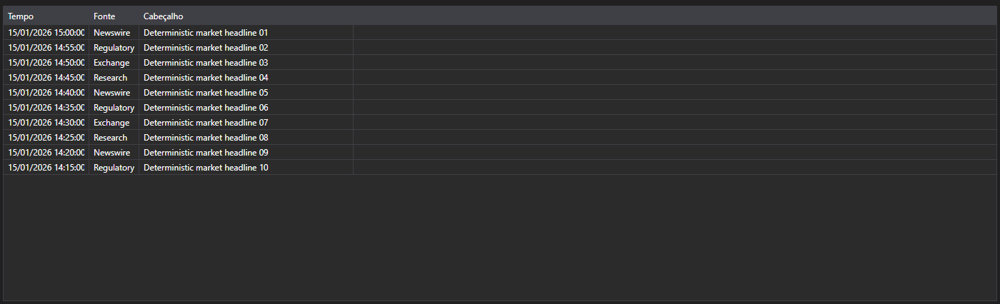
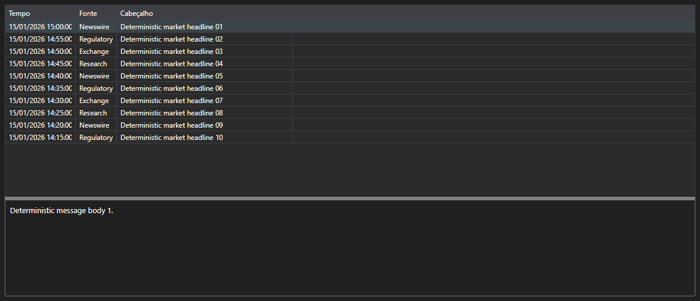

# Notícias como mensagens





[NewsMessageGrid](xref:StockSharp.Xaml.NewsMessageGrid) - uma tabela de notícias que trabalha com mensagens [NewsMessage](xref:StockSharp.Messages.NewsMessage) em vez de entidades de negócio. Mostra a hora, a fonte, o identificador, o título e o link para o texto completo.

**Propriedades principais**

- [NewsMessageGrid.Messages](xref:StockSharp.Xaml.NewsMessageGrid.Messages) - lista de mensagens de notícias.
- [NewsMessageGrid.SelectedMessage](xref:StockSharp.Xaml.NewsMessageGrid.SelectedMessage) - mensagem selecionada.
- [NewsMessageGrid.SelectedMessages](xref:StockSharp.Xaml.NewsMessageGrid.SelectedMessages) - mensagens selecionadas.
- [NewsMessageGrid.MaxCount](xref:StockSharp.Xaml.NewsMessageGrid.MaxCount) - número máximo de linhas da tabela; ao ser excedido as linhas mais antigas são removidas.
- [NewsMessageGrid.SubscriptionProvider](xref:StockSharp.Xaml.NewsMessageGrid.SubscriptionProvider) - provedor de assinaturas ao qual a tabela solicita o texto completo da notícia.

A combinação pronta de tabela e texto da notícia é o [NewsMessagePanel](xref:StockSharp.Xaml.NewsMessagePanel). Ele contém [NewsMessageGrid](xref:StockSharp.Xaml.NewsMessageGrid) e [NewsStoryPanel](xref:StockSharp.Xaml.NewsStoryPanel): ao selecionar uma linha o painel solicita o texto ao provedor de assinaturas e o exibe na parte inferior.

Abaixo estão fragmentos de código com seu uso:

```xaml
<Window x:Class="Sample.NewsWindow"
	xmlns="http://schemas.microsoft.com/winfx/2006/xaml/presentation"
	xmlns:x="http://schemas.microsoft.com/winfx/2006/xaml"
	xmlns:xaml="http://schemas.stocksharp.com/xaml"
	Height="400" Width="900">
	<xaml:NewsMessagePanel x:Name="NewsPanel" />
</Window>
```

```cs
// Definimos o provedor de assinaturas - por ele é solicitado o texto da notícia
NewsPanel.SubscriptionProvider = _connector;

// Adicionamos as notícias recebidas à tabela na thread da interface
_connector.NewsReceived += (subscription, news) =>
	this.GuiAsync(() => NewsPanel.NewsGrid.Messages.Add(news.ToMessage()));

// Criamos a assinatura de notícias
_connector.Subscribe(new Subscription(DataType.News));
```

## Veja também

[Dados de mercado](../market_data.md)
