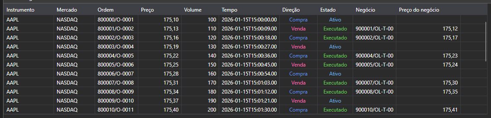

# Log de ordens



[OrderLogGrid](xref:StockSharp.Xaml.OrderLogGrid) - um componente gráfico para apresentar o log de ordens ([OrderLogItem](xref:StockSharp.BusinessEntities.OrderLogItem)).

**Propriedades e métodos principais**

- [OrderLogGrid.LogItems](xref:StockSharp.Xaml.OrderLogGrid.LogItems) - lista de itens do log de ordens.
- [OrderLogGrid.SelectedLogItem](xref:StockSharp.Xaml.OrderLogGrid.SelectedLogItem) - item do log de ordens selecionado.
- [OrderLogGrid.SelectedLogItems](xref:StockSharp.Xaml.OrderLogGrid.SelectedLogItems) - itens do log de ordens selecionados.

Abaixo encontram-se fragmentos de código que demonstram a sua utilização:

```xaml
<Window x:Class="SampleITCH.OrdersLogWindow"
		xmlns="http://schemas.microsoft.com/winfx/2006/xaml/presentation"
		xmlns:x="http://schemas.microsoft.com/winfx/2006/xaml"
		xmlns:loc="clr-namespace:StockSharp.Localization;assembly=StockSharp.Localization"
		xmlns:xaml="http://schemas.stocksharp.com/xaml"
		Title="{x:Static loc:LocalizedStrings.OrderLog}" Height="750" Width="900">
	<xaml:OrderLogGrid x:Name="OrderLogGrid" x:FieldModifier="public" />
</Window>
```

```cs
public class OrderLogWindow
{
	private readonly Connector _connector;
	private readonly Security _security;
	private Subscription _orderLogSubscription;
	
	public OrderLogWindow(Connector connector, Security security)
	{
		InitializeComponent();
		
		_connector = connector;
		_security = security;
		
		// Assinar o evento de recebimento de item do log de ordens
		_connector.OrderLogItemReceived += OnOrderLogItemReceived;
		
		// Criar uma assinatura para o log de ordens
		_orderLogSubscription = new Subscription(DataType.OrderLog, security);
		
		// Iniciar assinatura
		_connector.Subscribe(_orderLogSubscription);
	}
	
	// Manipulador do evento de recebimento de item do log de ordens
	private void OnOrderLogItemReceived(Subscription subscription, OrderLogItem item)
	{
		// Verificar se o item do log pertence à nossa assinatura
		if (subscription != _orderLogSubscription)
			return;
			
		// Adicionar item ao OrderLogGrid na thread da interface
		this.GuiAsync(() => OrderLogGrid.LogItems.Add(item));
	}
	
	// Método para cancelar a assinatura quando a janela é fechada
	public void Unsubscribe()
	{
		if (_orderLogSubscription != null)
		{
			_connector.OrderLogItemReceived -= OnOrderLogItemReceived;
			_connector.UnSubscribe(_orderLogSubscription);
			_orderLogSubscription = null;
		}
	}
}
```

### Filtragem do log de ordens

```cs
// Criar assinatura do log de ordens com filtragem
public void SubscribeOrderLog(Security security, DateTime from, DateTime to)
{
	// Criar uma assinatura para o log de ordens
	var orderLogSubscription = new Subscription(DataType.OrderLog, security)
	{
		MarketData =
		{
			// Especificar período para dados históricos
			From = from,
			To = to
		}
	};
	
	// Assinar o evento de recebimento de item do log de ordens
	_connector.OrderLogItemReceived += OnFilteredOrderLogItemReceived;
	
	// Iniciar assinatura
	_connector.Subscribe(orderLogSubscription);
}

// Manipulador do evento de recebimento do log de ordens com filtragem
private void OnFilteredOrderLogItemReceived(Subscription subscription, OrderLogItem item)
{
	// Verificar tipo de assinatura
	if (subscription.DataType != DataType.OrderLog)
		return;
		
	// Filtrar por preço (exemplo)
	if (item.Price < _minPrice || item.Price > _maxPrice)
		return;
		
	// Adicionar item ao OrderLogGrid na thread da interface
	this.GuiAsync(() => 
	{
		OrderLogGrid.LogItems.Add(item);
		
		// Limitar número de itens exibidos
		while (OrderLogGrid.LogItems.Count > _maxItems)
			OrderLogGrid.LogItems.RemoveAt(0);
	});
}
```

### Análise da dinâmica do log de ordens

```cs
	// Classe para analisar a dinâmica do log de ordens
public class OrderLogAnalyzer
{
	private readonly Connector _connector;
	private readonly Security _security;
	private readonly OrderLogGrid _orderLogGrid;
	
	// Contadores para análise
	private int _buyCount = 0;
	private int _sellCount = 0;
	private decimal _buyVolume = 0;
	private decimal _sellVolume = 0;
	
	public OrderLogAnalyzer(Connector connector, Security security, OrderLogGrid orderLogGrid)
	{
		_connector = connector;
		_security = security;
		_orderLogGrid = orderLogGrid;
		
		// Assinar o evento de recebimento de item do log de ordens
		_connector.OrderLogItemReceived += OnOrderLogItemReceived;
		
		// Criar uma assinatura para o log de ordens
		var subscription = new Subscription(DataType.OrderLog, security);
		
		// Iniciar assinatura
		_connector.Subscribe(subscription);
	}
	
	// Manipulador do evento de recebimento de item do log de ordens
	private void OnOrderLogItemReceived(Subscription subscription, OrderLogItem item)
	{
		if (item.SecurityId != _security.ToSecurityId())
			return;
			
		// Analisar item do log de ordens
		if (item.Side == Sides.Buy)
		{
			_buyCount++;
			_buyVolume += item.Volume;
		}
		else if (item.Side == Sides.Sell)
		{
			_sellCount++;
			_sellVolume += item.Volume;
		}
		
		// Atualizar interface com resultados da análise
		this.GuiAsync(() => 
		{
			// Adicionar item ao OrderLogGrid
			_orderLogGrid.LogItems.Add(item);
			
			// Atualizar estatísticas
			UpdateStatistics();
		});
	}
	
	// Atualizar estatísticas
	private void UpdateStatistics()
	{
		BuyCountLabel.Content = $"Compras: {_buyCount}";
		SellCountLabel.Content = $"Vendas: {_sellCount}";
		BuyVolumeLabel.Content = $"Volume de compra: {_buyVolume}";
		SellVolumeLabel.Content = $"Volume de venda: {_sellVolume}";
		
		// Calcular desequilíbrio
		var volumeImbalance = _buyVolume - _sellVolume;
		var imbalancePercent = (_buyVolume + _sellVolume) > 0 
			? volumeImbalance / (_buyVolume + _sellVolume) * 100 
			: 0;
			
		ImbalanceLabel.Content = $"Desequilíbrio: {volumeImbalance:F2} ({imbalancePercent:F2}%)";
	}
}
```
