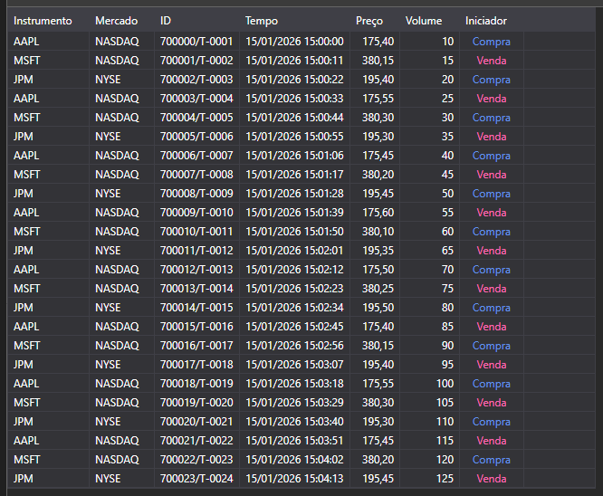

# Negócios tick



[TradeGrid](xref:StockSharp.Xaml.TradeGrid) - uma tabela de negócios.

**Propriedades principais**

- [TradeGrid.Trades](xref:StockSharp.Xaml.TradeGrid.Trades) - lista de negócios.
- [TradeGrid.SelectedTrade](xref:StockSharp.Xaml.TradeGrid.SelectedTrade) - negócio selecionado.
- [TradeGrid.SelectedTrades](xref:StockSharp.Xaml.TradeGrid.SelectedTrades) - negócios selecionados.

Abaixo encontram-se fragmentos de código que demonstram a sua utilização:

```xaml
<Window x:Class="Sample.TradesWindow"
	xmlns="http://schemas.microsoft.com/winfx/2006/xaml/presentation"
	xmlns:x="http://schemas.microsoft.com/winfx/2006/xaml"
	xmlns:loc="clr-namespace:StockSharp.Localization;assembly=StockSharp.Localization"
	xmlns:xaml="http://schemas.stocksharp.com/xaml"
	Title="{x:Static loc:LocalizedStrings.Str985}" Height="284" Width="544">
	<xaml:TradeGrid x:Name="TradeGrid" x:FieldModifier="public" />
</Window>
```

```cs
public class TradesWindow
{
	private readonly Connector _connector;
	private readonly Security _security;
	private Subscription _tickSubscription;
	
	public TradesWindow(Connector connector, Security security)
	{
		InitializeComponent();
		
		_connector = connector;
		_security = security;
		
		// Assinar evento de recebimento de negociações tick
		_connector.TickTradeReceived += OnTickReceived;
		
		// Criar uma assinatura para negociações tick
		_tickSubscription = new Subscription(DataType.Ticks, security);
		
		// Iniciar assinatura
		_connector.Subscribe(_tickSubscription);
	}
	
	// Manipulador do evento de recebimento de negociações tick
	private void OnTickReceived(Subscription subscription, ITickTradeMessage tick)
	{
		// Verificar se a negociação pertence à nossa assinatura
		if (subscription != _tickSubscription)
			return;
			
		// Adicionar negociação ao TradeGrid na thread da interface
		this.GuiAsync(() => TradeGrid.Trades.Add(tick));
	}
	
	// Método para cancelar a assinatura quando a janela é fechada
	public void Unsubscribe()
	{
		if (_tickSubscription != null)
		{
			_connector.TickTradeReceived -= OnTickReceived;
			_connector.UnSubscribe(_tickSubscription);
			_tickSubscription = null;
		}
	}
}
```

### Apresentar negócios próprios

```cs
public class MyTradesWindow
{
	private readonly Connector _connector;
	
	public MyTradesWindow(Connector connector)
	{
		InitializeComponent();
		
		_connector = connector;
		
		// Assinar evento de recebimento de negociações próprias
		_connector.OwnTradeReceived += OnOwnTradeReceived;
		
		// Criar assinatura de dados transacionais
		var myTradesSubscription = new Subscription(DataType.Transactions, null);
		
		// Iniciar assinatura
		_connector.Subscribe(myTradesSubscription);
	}
	
	// Manipulador do evento de recebimento de negociações próprias
	private void OnOwnTradeReceived(Subscription subscription, MyTrade myTrade)
	{
		// Adicionar negociação própria ao TradeGrid na thread da interface
		this.GuiAsync(() => TradeGrid.Trades.Add(myTrade));
	}
}
```

### Obter negócios tick históricos

```cs
// Método para obter negociações tick históricas
public void LoadHistoricalTicks(Security security, DateTime from, DateTime to)
{
	// Limpar negociações atuais
	TradeGrid.Trades.Clear();
	
	// Criar assinatura de negociações tick históricas
	var historySubscription = new Subscription(DataType.Ticks, security)
	{
		MarketData =
		{
			// Especificar período para dados históricos
			From = from,
			To = to
		}
	};
	
	// Assinar evento de recebimento de negociações tick
	_connector.TickTradeReceived += OnHistoricalTickReceived;
	
	// Iniciar assinatura
	_connector.Subscribe(historySubscription);
}

// Manipulador do evento de recebimento de negociações tick históricas
private void OnHistoricalTickReceived(Subscription subscription, ITickTradeMessage tick)
{
	// Adicionar tick ao TradeGrid na thread da interface
	this.GuiAsync(() => 
	{
		TradeGrid.Trades.Add(tick);
		
		// Atualizar estatísticas
		UpdateTradeStatistics();
	});
}

// Método para atualizar estatísticas de negociações
private void UpdateTradeStatistics()
{
	int totalTrades = TradeGrid.Trades.Count;
	decimal totalVolume = TradeGrid.Trades.Sum(t => t.Volume);
	decimal averagePrice = TradeGrid.Trades.Any() 
		? TradeGrid.Trades.Average(t => t.Price)
		: 0;
	
	// Atualizar elementos de estatísticas da interface
	TotalTradesLabel.Content = $"Total trades: {totalTrades}";
	TotalVolumeLabel.Content = $"Total volume: {totalVolume}";
	AveragePriceLabel.Content = $"Average price: {averagePrice:F2}";
}
```

### Filtrar negócios por volume

```cs
// Método para filtrar negociações por volume mínimo
public void FilterTicksByVolume(decimal minVolume)
{
	// Salvar valor do filtro
	_minVolumeFilter = minVolume;
	
	// Atualizar manipulador do evento de recebimento de negociações tick
	_connector.TickTradeReceived -= OnTickReceived;
	_connector.TickTradeReceived += OnFilteredTickReceived;
}

// Manipulador do evento de recebimento de negociações tick com filtro de volume
private void OnFilteredTickReceived(Subscription subscription, ITickTradeMessage tick)
{
	// Verificar se a negociação pertence ao instrumento selecionado
	if (tick.SecurityId != _security.ToSecurityId())
		return;
		
	// Aplicar filtro de volume
	if (tick.Volume < _minVolumeFilter)
		return;
		
	// Adicionar negociação ao TradeGrid na thread da interface
	this.GuiAsync(() => TradeGrid.Trades.Add(tick));
	
	// Se for uma negociação grande, pode destacá-la ou enviar uma notificação
	if (tick.Volume >= _largeVolumeThreshold)
	{
		NotifyLargeVolumeTrade(tick);
	}
}

// Método para notificação de grande negociação
private void NotifyLargeVolumeTrade(ITickTradeMessage tick)
{
	// Exibir informações sobre a grande negociação
	Console.WriteLine($"Grande negócio: {tick.SecurityId}, {tick.ServerTime}, Preço: {tick.Price}, Volume: {tick.Volume}");
	
	// É possível adicionar notificação sonora ou visual
	this.GuiAsync(() => 
	{
		// Exemplo de destaque visual na lista
		var tradeItem = TradeGrid.Trades.LastOrDefault();
		if (tradeItem != null)
		{
			TradeGrid.SelectedTrade = tradeItem;
			HighlightTrade(tradeItem);
		}
	});
}
```
