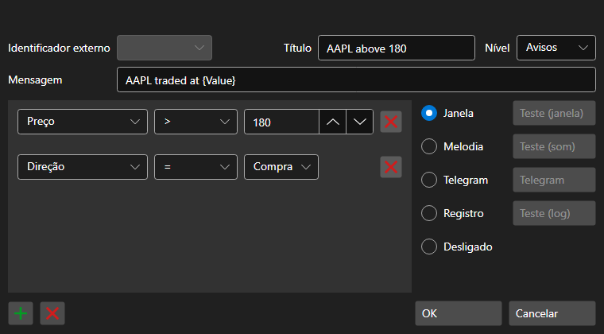

# Janela de definições de notificações

[AlertSettingsWindow](xref:StockSharp.Alerts.AlertSettingsWindow) - janela para configurar notificações para determinados eventos

Pode configurar notificações sobre alterações dos seguintes tipos de dados: Portfolio, Client code, Broker, Depository, Server time, Transaction, Data type, Cancel, Order ID, Order ID (string), Order ID (platform), Derivative, Derivative (string), Price, Volume (order), Volume (trade), Visible volume, Direction, Balance, Order type, Status, Comment, Order message, System order, Order expiration time, Execution condition, Price, Trade initiator, Open interest, Error, Condition, Uptrend, Commission, Delay, Slippage, Identifier (user), Currency, P\/L, Position, Market maker.

As notificações podem ter as seguintes formas:

- **Window** - será apresentada uma pequena janela pop-up com uma mensagem no canto do ecrã.
- **Melody** - a melodia será reproduzida.
- **SMS** - será enviada uma mensagem por SMS.
- **Email** - será enviada uma mensagem por email.
- **Speech** - a mensagem será pronunciada pela voz gerada pelo computador.
- **Log** - será enviada uma mensagem para a janela Logs do Designer.
- **Disabled** - a notificação não será apresentada.
