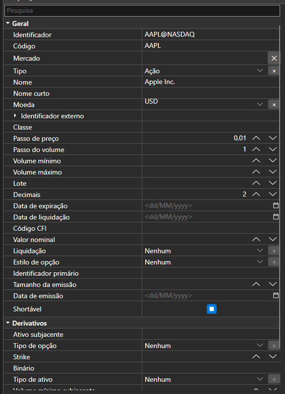

# Tabela de edição de propriedades de objetos

[PropertyGridEx](xref:StockSharp.Xaml.PropertyGrid.PropertyGridEx) - a tabela para editar propriedades de objetos. O componente inclui um conjunto de editores adicionais para tipos do sistema e tipos [S#](../../api.md).



[PropertyGridEx](xref:StockSharp.Xaml.PropertyGrid.PropertyGridEx) tem editores próprios para os seguintes tipos:

- [Unit](xref:StockSharp.Messages.Unit).
- [Security](xref:StockSharp.BusinessEntities.Security).
- [Portfolio](xref:StockSharp.BusinessEntities.Portfolio).
- [ExchangeBoard](xref:StockSharp.BusinessEntities.ExchangeBoard).
- [Exchange](xref:StockSharp.BusinessEntities.Exchange).
- Diretório **ExtensionInfo**.
- [System.TimeSpan](xref:System.TimeSpan), [System.DateTime](xref:System.DateTime) e [System.DateTimeOffset](xref:System.DateTimeOffset).
- [System.Net.EndPoint](xref:System.Net.EndPoint) e [System.Net.IPAddress](xref:System.Net.IPAddress).
- [System.Security.SecureString](xref:System.Security.SecureString).
- [System.Text.Encoding](xref:System.Text.Encoding).
- [System.Enum](xref:System.Enum).

**Propriedades principais**

- [PropertyGridEx.SecurityProvider](xref:StockSharp.Xaml.PropertyGrid.PropertyGridEx.SecurityProvider) - o fornecedor de informação sobre instrumentos.
- [PropertyGridEx.ExchangeInfoProvider](xref:StockSharp.Xaml.PropertyGrid.PropertyGridEx.ExchangeInfoProvider) - o fornecedor de informação do site.
- [PropertyGridEx.Portfolios](xref:StockSharp.Xaml.PropertyGrid.PropertyGridEx.Portfolios) - a lista de portfólios disponíveis.
- **SelectedObject** - o objeto cujas propriedades serão apresentadas na tabela.

Abaixo está um excerto de código com a sua utilização. O exemplo de código foi retirado de *Samples\/Fix\/SampleFix*.

```xaml
<Window x:Class="SampleFix.MainWindow"
		xmlns="http://schemas.microsoft.com/winfx/2006/xaml/presentation"
		xmlns:x="http://schemas.microsoft.com/winfx/2006/xaml"
		xmlns:loc="clr-namespace:StockSharp.Localization;assembly=StockSharp.Localization"
		xmlns:propertyGrid="http://schemas.stocksharp.com/xaml"
		Title="{x:Static loc:LocalizedStrings.XamlStr540}" Height="110" Width="512">
	<Grid>
		<Grid.ColumnDefinitions>
			<ColumnDefinition />
			<ColumnDefinition />
			<ColumnDefinition />
			<ColumnDefinition />
			<ColumnDefinition />
		</Grid.ColumnDefinitions>
		<Grid.RowDefinitions>
			<RowDefinition Height="24" />
			<RowDefinition Height="Auto" />
			<RowDefinition Height="Auto" />
		</Grid.RowDefinitions>
		<StackPanel Grid.Column="0" Grid.Row="0" Grid.ColumnSpan="5" Orientation="Horizontal">
			<xctk:DropDownButton Content="{x:Static loc:LocalizedStrings.TransactionalSession}">
				<xctk:DropDownButton.DropDownContent>
					<propertyGrid:PropertyGridEx x:Name="TransactionSessionSettings" />
				</xctk:DropDownButton.DropDownContent>
			</xctk:DropDownButton>
			<xctk:DropDownButton Content="{x:Static loc:LocalizedStrings.MarketDataSession}">
				<xctk:DropDownButton.DropDownContent>
					<propertyGrid:PropertyGridEx x:Name="MarketDataSessionSettings" />
				</xctk:DropDownButton.DropDownContent>
			</xctk:DropDownButton>
		</StackPanel>
		
		<Button x:Name="ConnectBtn" Background="LightPink" Grid.Column="0" Grid.Row="1" Grid.RowSpan="2" Content="{x:Static loc:LocalizedStrings.Connect}" Click="ConnectClick" />
		<Button x:Name="ShowSecurities" Grid.Column="1" Grid.Row="1" IsEnabled="False" Content="{x:Static loc:LocalizedStrings.Securities}" Click="ShowSecuritiesClick" />
		<Button x:Name="ShowPortfolios" Grid.Column="2" Grid.Row="1" IsEnabled="False" Content="{x:Static loc:LocalizedStrings.Portfolios}" Click="ShowPortfoliosClick" />
		<Button x:Name="ShowStopOrders" Grid.Column="3" Grid.Row="1" IsEnabled="False" Content="{x:Static loc:LocalizedStrings.StopOrders}" Click="ShowStopOrdersClick" />
		<Button x:Name="ShowNews" Grid.Column="4" Grid.Row="1" IsEnabled="False" Content="{x:Static loc:LocalizedStrings.News}" Click="ShowNewsClick" />
		
		<Button x:Name="ShowTrades" Grid.Column="1" Grid.Row="2" IsEnabled="False" Content="{x:Static loc:LocalizedStrings.Ticks}" Click="ShowTradesClick" />
		<Button x:Name="ShowMyTrades" Grid.Column="2" Grid.Row="2" IsEnabled="False" Content="{x:Static loc:LocalizedStrings.MyTrades}" Click="ShowMyTradesClick" />
		<Button x:Name="ShowOrders" Grid.Column="3" Grid.Row="2" IsEnabled="False" Content="{x:Static loc:LocalizedStrings.Orders}" Click="ShowOrdersClick" />
	</Grid>
</Window>
	  				
```
```cs
private readonly Connector _connector = new Connector();
public MainWindow()
{
	InitializeComponent();
	Title = Title.Put("FIX");
	_ordersWindow.MakeHideable();
	_myTradesWindow.MakeHideable();
	_tradesWindow.MakeHideable();
	_securitiesWindow.MakeHideable();
	_stopOrdersWindow.MakeHideable();
	_portfoliosWindow.MakeHideable();
	_newsWindow.MakeHideable();
	if (File.Exists(_settingsFile))
	{
		_connector_connector.Load(new JsonSerializer<SettingsStorage>().Deserialize(_settingsFile));
	}
	MarketDataSessionSettings.SelectedObject = ((ChannelMessageAdapter)_connector.MarketDataAdapter).InnerAdapter;
	TransactionSessionSettings.SelectedObject = ((ChannelMessageAdapter)_connector.TransactionAdapter).InnerAdapter;
	Instance = this;
	_connector.LogLevel = LogLevels.Debug;
	_logManager.Sources.Add(_connector);
	_logManager.Listeners.Add(new FileLogListener { LogDirectory = "StockSharp_Fix" });
}
	  				
```
