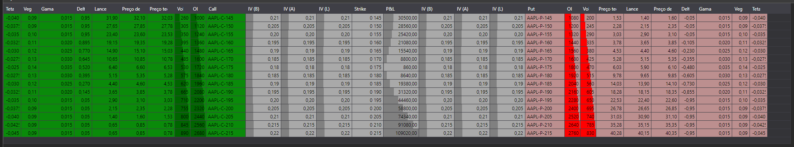

# Mesa de opções

O componente gráfico [OptionDesk](xref:StockSharp.Xaml.OptionDesk) é uma tabela para apresentar a mesa de opções. Mostra as gregas, a volatilidade implícita, o preço teórico, a melhor oferta de venda e a melhor oferta de compra para opções Put e Call.

Abaixo está o exemplo **OptionCalculator**, que utiliza este componente. O código-fonte do exemplo pode ser encontrado na pasta *Samples\/06\_Strategies\/09\_LiveOptionsQuoting*.



## Exemplo OptionCalculator

1. No código XAML, adicione o elemento [OptionDesk](xref:StockSharp.Xaml.OptionDesk) e atribua-lhe o nome **Desk**.

   ```xaml
   <Window x:Class="OptionCalculator.MainWindow"
           xmlns="http://schemas.microsoft.com/winfx/2006/xaml/presentation"
           xmlns:x="http://schemas.microsoft.com/winfx/2006/xaml"
           xmlns:loc="clr-namespace:StockSharp.Localization;assembly=StockSharp.Localization"
           xmlns:xaml="http://schemas.stocksharp.com/xaml"
           Title="{x:Static loc:LocalizedStrings.XamlStr396}" Height="400" Width="1030">
       <Grid Margin="5,5,5,5">
       
   	    .........................................................
   	    
   	    <xaml:OptionDesk x:Name="Desk" Grid.Row="6" Grid.ColumnSpan="3" Grid.Column="0" />
       
   	</Grid>
   </Window>
   	  				
   ```
2. No código C#, crie uma ligação e subscreva os eventos necessários.

   ```cs
   ...                 
   public readonly Connector Connector = new Connector();
   ...                 
   // assinar o evento de ligação bem-sucedida
   Connector.Connected += () =>
   {
   	// atualizar rótulos da interface
   	this.GuiAsync(() => ChangeConnectStatus(true));
   };
   // assinar o evento de desligação
   Connector.Disconnected += () =>
   {
   	// atualizar rótulos da interface
   	this.GuiAsync(() => ChangeConnectStatus(false));
   };
   // assinar o evento de erro de ligação
   Connector.ConnectionError += error => this.GuiAsync(() =>
   {
   	// atualizar rótulos da interface
   	ChangeConnectStatus(false);
   	MessageBox.Show(this, error.ToString(), LocalizedStrings.ErrorConnection);
   });
   // preencher a lista de ativos subjacentes
   Connector.SecurityReceived += (sub, security) =>
   {
   	if (security.Type == SecurityTypes.Future)
   		_assets.Add(security);
   };
   Connector.Level1Received += (sub, security) =>
   {
   	if (_model.UnderlyingAsset == security || _model.UnderlyingAsset.Id == security.UnderlyingSecurityId)
   		_isDirty = true;
   };
   // assinatura de preços tick e atualização do preço do ativo
   Connector.TickTradeReceived += (sub, trade) =>
   {
   	if (_model.UnderlyingAsset == trade.Security || _model.UnderlyingAsset.Id == trade.Security.UnderlyingSecurityId)
   		_isDirty = true;
   };
   Connector.NewPosition += position => this.GuiAsync(() =>
   {
   	var asset = SelectedAsset;
   	if (asset == null)
   		return;
   	var assetPos = position.Security == asset;
   	var newPos = position.Security.UnderlyingSecurityId == asset.Id;
   	if (!assetPos && !newPos)
   		return;
   	if (assetPos)
   		PosChart.AssetPosition = position;
   	if (newPos)
   		PosChart.Positions.Add(position);
   	RefreshChart();
   });
   Connector.PositionChanged += position => this.GuiAsync(() =>
   {
   	if ((PosChart.AssetPosition != null && PosChart.AssetPosition == position) || PosChart.Positions.Cache.Contains(position))
   		RefreshChart();
   });
   try
   {
   	if (File.Exists(_settingsFile))
   		Connector.Load(new JsonSerializer<SettingsStorage>().Deserialize(_settingsFile));
   }
   ...
   ```
3. Ao ligar, defina o fornecedor de mensagens para os dados de mercado.

   ```cs
   private void ConnectClick(object sender, RoutedEventArgs e)
   {
   	if (!_isConnected)
   	{
   		ConnectBtn.IsEnabled = false;
   		_model.Clear();
   		_model.MarketDataProvider = Connector;
   ...
   		Connector.Connect();
   	}
   	else
   		Connector.Disconnect();
   }
   ```
4. Ao receber instrumentos, adicionamos os ativos subjacentes à lista.

   ```cs
   // preencher a lista de ativos subjacentes
   Connector.SecurityReceived += (sub, security) =>
   {
   	if (security.Type == SecurityTypes.Future)
   		_assets.Add(security);
   };
   ```
5. Ao selecionar um instrumento:
   - Preencha o array com uma cadeia de opções, em que o instrumento selecionado atua como ativo subjacente;
   - Atribua este array à propriedade [OptionDeskModel.Options](xref:StockSharp.Xaml.OptionDeskModel.Options);
   - Limpe os valores da mesa de opções com o método [OptionDeskModel.Clear](xref:StockSharp.Xaml.OptionDeskModel.Clear).
   ```cs
   private void Assets_OnSelectionChanged(object sender, SelectionChangedEventArgs e)
   {
   	var asset = SelectedAsset;
   	_model.UnderlyingAsset = asset;
   	_model.Clear();
   	_options.Clear();
   	var options = asset.GetDerivatives(Connector);
   	foreach (var security in options)
   	{
   		_model.Add(security);
   		_options.Add(security);
   	}
   	ProcessPositions();
   }
   ```

## Conteúdo recomendado

[Gregas](../../options/greeks.md)
