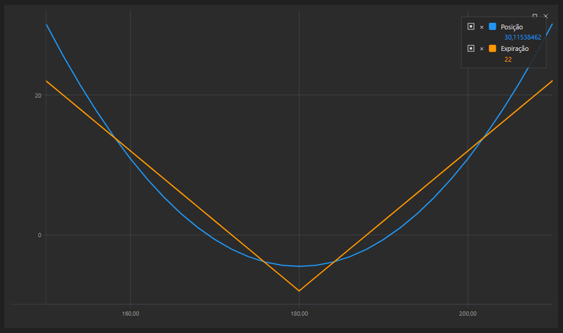

# Gráfico de posição

O componente gráfico [OptionPositionChart](xref:StockSharp.Xaml.Charting.OptionPositionChart) é um gráfico que mostra a posição e as gregas das opções relacionadas com o ativo subjacente.

Segue-se o exemplo SampleOptionQuoting, no qual este gráfico é utilizado. O código-fonte do exemplo pode ser encontrado na pasta *Samples\/06\_Strategies\/09\_LiveOptionsQuoting*.



## Exemplo SampleOptionQuoting

1. No código XAML, adicione o elemento [OptionPositionChart](xref:StockSharp.Xaml.Charting.OptionPositionChart) e atribua-lhe o nome **PosChart**.

   ```xaml
   <Window x:Class="OptionCalculator.MainWindow"
           xmlns="http://schemas.microsoft.com/winfx/2006/xaml/presentation"
           xmlns:x="http://schemas.microsoft.com/winfx/2006/xaml"
           xmlns:loc="clr-namespace:StockSharp.Localization;assembly=StockSharp.Localization"
           xmlns:xaml="http://schemas.stocksharp.com/xaml"
           Title="{x:Static loc:LocalizedStrings.XamlStr396}" Height="400" Width="1030">
       <Grid Margin="5,5,5,5">
       
   	    .........................................................
   	    
   	    <xaml:OptionPositionChart x:Name="PosChart" Grid.Row="7" Grid.Column="0" Grid.ColumnSpan="6" />
   	</Grid>
   </Window>
   				
   ```

2. No código C#, crie uma ligação e subscreva os eventos necessários.

   ```cs
   ...                 
   public readonly Connector Connector = new Connector();
   ...                 
   // assinar o evento de conexão bem-sucedida
   Connector.Connected += () =>
   {
   	// atualizar rótulos da interface
   	this.GuiAsync(() => ChangeConnectStatus(true));
   };
   // assinar o evento de desconexão
   Connector.Disconnected += () =>
   {
   	// atualizar rótulos da interface
   	this.GuiAsync(() => ChangeConnectStatus(false));
   };
   // assinar o evento de erro de conexão
   Connector.ConnectionError += error => this.GuiAsync(() =>
   {
   	// atualizar rótulos da interface
   	ChangeConnectStatus(false);
   	MessageBox.Show(this, error.ToString(), LocalizedStrings.ErrorConnection);
   });
   // preencher a lista de ativos subjacentes
   Connector.SecurityReceived += (sub, security) =>
   {
   	if (security.Type == SecurityTypes.Future)
   		_assets.Add(security);
   };
   Connector.Level1Received += (sub, security) =>
   {
   	if (_model.UnderlyingAsset == security || _model.UnderlyingAsset.Id == security.UnderlyingSecurityId)
   		_isDirty = true;
   };
   // assinatura de preços tick e atualização do preço do ativo
   Connector.TickTradeReceived += (sub, trade) =>
   {
   	if (_model.UnderlyingAsset == trade.Security || _model.UnderlyingAsset.Id == trade.Security.UnderlyingSecurityId)
   		_isDirty = true;
   };
   Connector.NewPosition += position => this.GuiAsync(() =>
   {
   	var asset = SelectedAsset;
   	if (asset == null)
   		return;
   	var assetPos = position.Security == asset;
   	var newPos = position.Security.UnderlyingSecurityId == asset.Id;
   	if (!assetPos && !newPos)
   		return;
   	RefreshChart();
   });
   Connector.PositionChanged += position => this.GuiAsync(() =>
   {
   	if ((PosChart.AssetPosition != null && PosChart.AssetPosition == position) || PosChart.Positions.Cache.Contains(position))
   		RefreshChart();
   });
   try
   {
   	if (File.Exists(_settingsFile))
   		Connector.Load(new JsonSerializer<SettingsStorage>().Deserialize(_settingsFile));
   }
   ...
   ```

3. Ao ligar, defina as configurações iniciais do controlo:

   1. Repor o modelo do controlo [OptionPositionChart.Model](xref:StockSharp.Xaml.Charting.OptionPositionChart.Model);
   2. Redesenhar o gráfico com os valores iniciais [OptionPositionChart.Refresh](xref:StockSharp.Xaml.Charting.OptionPositionChart.Refresh(System.Nullable{System.Decimal},System.Nullable{System.DateTimeOffset},System.Nullable{System.DateTimeOffset}))**(**[System.Nullable\<System.Decimal\>](xref:System.Nullable`1) assetPrice, [System.Nullable\<System.DateTimeOffset\>](xref:System.Nullable`1) currentTime, [System.Nullable\<System.DateTimeOffset\>](xref:System.Nullable`1) expiryDate **)**;
   3. Especificar o fornecedor de mensagens para dados de mercado e instrumentos.

   ```cs
   private void ConnectClick(object sender, RoutedEventArgs e)
   {
   	if (!_isConnected)
   	{
   		ConnectBtn.IsEnabled = false;
   ...
   		PosChart.Model = null;
   ...
   		PosChart.MarketDataProvider = Connector;
   		PosChart.SecurityProvider = Connector;
   		PosChart.PositionProvider = Connector;
   		Connector.Connect();
   	}
   	else
   		Connector.Disconnect();
   }
   ```

4. Ao receber instrumentos, adicionamos os ativos subjacentes à lista.

   ```cs
   Connector.SecurityReceived += (sub, security) =>
   {
   	if (security.Type == SecurityTypes.Future)
   		_assets.Add(security);
   };
   ```

5. Ao alterar o Level1 do instrumento subjacente ou das opções, bem como ao obter um novo negócio, definimos a flag \_isDirty. Isto permite chamar o método RefreshChart (ver abaixo) no evento do temporizador (o código é omitido) para redesenhar o gráfico. Assim, controlamos a frequência de redesenho.

   ```cs
   Connector.Level1Received += (sub, security) =>
   {
   	if (_model.UnderlyingAsset == security || _model.UnderlyingAsset.Id == security.UnderlyingSecurityId)
   		_isDirty = true;
   };
   Connector.TickTradeReceived += (sub, trade) =>
   {
   	if (_model.UnderlyingAsset == trade.Security || _model.UnderlyingAsset.Id == trade.Security.UnderlyingSecurityId)
   		_isDirty = true;
   };
   ```

6. No manipulador do evento de ocorrência de nova posição, chamamos `RefreshChart` para redesenhar o gráfico.

   ```cs
   Connector.NewPosition += position => this.GuiAsync(() =>
   {
   	var asset = SelectedAsset;
   	if (asset == null)
   		return;
   	var assetPos = position.Security == asset;
   	var newPos = position.Security.UnderlyingSecurityId == asset.Id;
   	if (!assetPos && !newPos)
   		return;
   	RefreshChart();
   });
   Connector.PositionChanged += position => this.GuiAsync(() =>
   {
   	if ((PosChart.AssetPosition != null && PosChart.AssetPosition == position) || PosChart.Positions.Cache.Contains(position))
   		RefreshChart();
   });
   ```

7. Este método redesenha o gráfico:

   ```cs
   private void RefreshChart()
   {
   	var asset = SelectedAsset;
   	var trade = asset.LastTrade;
   	if (trade != null)
   		PosChart.Refresh(trade.Price);
   }
   ```

## Conteúdo recomendado

[Negociação de volatilidade](../../options/volatility_trading.md)
