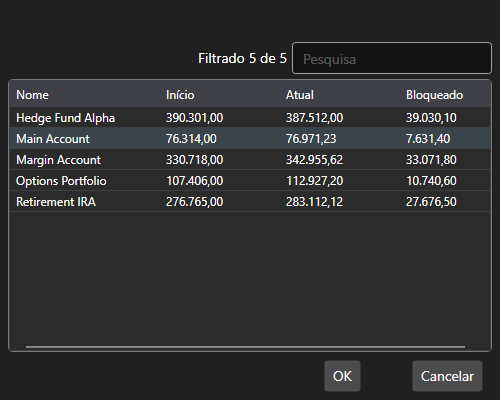

# Janela de seleção de portfólio

[PortfolioPickerWindow](xref:StockSharp.Xaml.PortfolioPickerWindow) é uma janela para selecionar um portfólio. A janela apresenta uma lista de portfólios e informações sobre as posições de caixa dos portfólios.



**Propriedades principais**

- [PortfolioPickerWindow.Portfolios](xref:StockSharp.Xaml.PortfolioPickerWindow.Portfolios) - a lista de portfólios.
- [PortfolioPickerWindow.SelectedPortfolio](xref:StockSharp.Xaml.PortfolioPickerWindow.SelectedPortfolio) - o portfólio selecionado.

Abaixo está o fragmento de código com a sua utilização.

```cs
private void Button_Click(object sender, RoutedEventArgs e)
{
	var wnd = new PortfolioPickerWindow();
	if (Portfolios != null)
		wnd.Portfolios = Portfolios;
	if (wnd.ShowModal(this))
	{
		SelectedPortfolio = wnd.SelectedPortfolio;
	}
}
	  				
```
