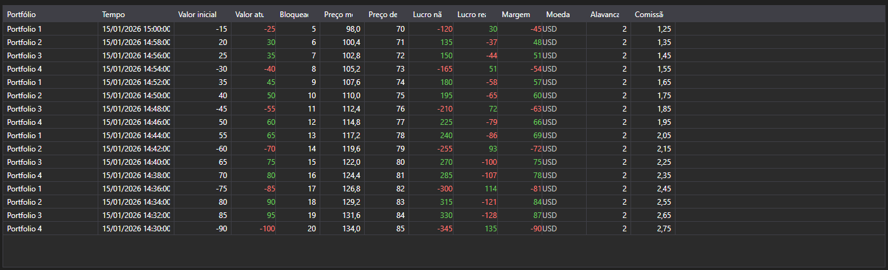

# Mudanças de posições



[PositionChangeGrid](xref:StockSharp.Xaml.PositionChangeGrid) - uma tabela de mensagens [PositionChangeMessage](xref:StockSharp.Messages.PositionChangeMessage). Diferente da tabela de portfólios, mostra não o estado atual mas o fluxo de mudanças: cada linha é uma mensagem com o conjunto de valores alterados.

**Propriedades principais**

- [PositionChangeGrid.Messages](xref:StockSharp.Xaml.PositionChangeGrid.Messages) - lista de mensagens de mudança de posições.
- [PositionChangeGrid.SelectedMessage](xref:StockSharp.Xaml.PositionChangeGrid.SelectedMessage) - mensagem selecionada.
- [PositionChangeGrid.SelectedMessages](xref:StockSharp.Xaml.PositionChangeGrid.SelectedMessages) - mensagens selecionadas.
- [PositionChangeGrid.MaxCount](xref:StockSharp.Xaml.PositionChangeGrid.MaxCount) - número máximo de linhas da tabela; ao ser excedido as linhas mais antigas são removidas.

Esse fluxo é útil ao investigar divergências: vê-se qual valor o conector enviou e quando, não apenas o resultado final.

Abaixo estão fragmentos de código com seu uso:

```xaml
<Window x:Class="Sample.PositionChangesWindow"
	xmlns="http://schemas.microsoft.com/winfx/2006/xaml/presentation"
	xmlns:x="http://schemas.microsoft.com/winfx/2006/xaml"
	xmlns:xaml="http://schemas.stocksharp.com/xaml"
	Height="400" Width="900">
	<xaml:PositionChangeGrid x:Name="PositionChangeGrid" />
</Window>
```

```cs
// Recebemos as mudanças de posições do conector
_connector.PositionReceived += (subscription, position) =>
{
	var message = position.ToChangeMessage();

	// Adicionamos a mensagem à tabela na thread da interface
	this.GuiAsync(() => PositionChangeGrid.Messages.Add(message));
};

// Criamos a assinatura de mudanças de posições
_connector.Subscribe(new Subscription(DataType.PositionChanges));
```

## Veja também

[Portfólios](../portfolios.md)
