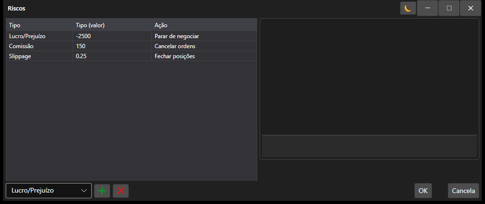

# Janela de definições de risco

[AlertSettingsWindow](xref:StockSharp.Alerts.AlertSettingsWindow) - Uma janela especial para configurar o controlo de risco.



Segue-se um exemplo do código para chamar a janela de definições de controlo de risco para a estratégia.

```cs
		private void RiskButton_OnClick(object sender, RoutedEventArgs e)
		{
			var wnd = new RiskWindow();
			wnd.Rules.AddRange(Strategy.RiskManager.Rules.Select(r => r.Clone()));
			if (!wnd.ShowModal(this))
				return;
			Strategy.RiskManager.Rules.Clear();
			Strategy.RiskManager.Rules.AddRange(wnd.Rules);
		}
	  				
```
