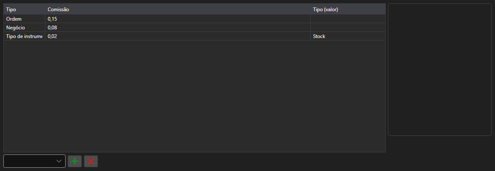

# Regras de comissão



[CommissionPanel](xref:StockSharp.Xaml.CommissionPanel) - uma tabela de regras de comissão. Cada linha é uma regra [ICommissionRule](xref:StockSharp.Algo.Commissions.ICommissionRule): por negócio, por volume, por giro ou um percentual do valor.

**Propriedades principais**

- [CommissionPanel.Rules](xref:StockSharp.Xaml.CommissionPanel.Rules) - lista de regras de comissão.

As regras desta tabela são passadas ao gestor de comissões, de modo que o teste sobre histórico calcula os custos do mesmo jeito que a operação real.

Abaixo estão fragmentos de código com seu uso:

```xaml
<Window x:Class="Sample.CommissionWindow"
	xmlns="http://schemas.microsoft.com/winfx/2006/xaml/presentation"
	xmlns:x="http://schemas.microsoft.com/winfx/2006/xaml"
	xmlns:xaml="http://schemas.stocksharp.com/xaml"
	Height="300" Width="700">
	<xaml:CommissionPanel x:Name="CommissionPanel" />
</Window>
```

```cs
// Comissão por negócio
CommissionPanel.Rules.Add(new CommissionPerTradeRule { Value = 1.5m });

// Comissão por volume da ordem
CommissionPanel.Rules.Add(new CommissionPerOrderVolumeRule { Value = 0.01m });

// Aplicamos as regras ao gestor de comissões
_connector.CommissionManager.Rules.Clear();
_connector.CommissionManager.Rules.AddRange(CommissionPanel.Rules);
```

## Veja também

[Painéis de serviço](../service_panels.md)
