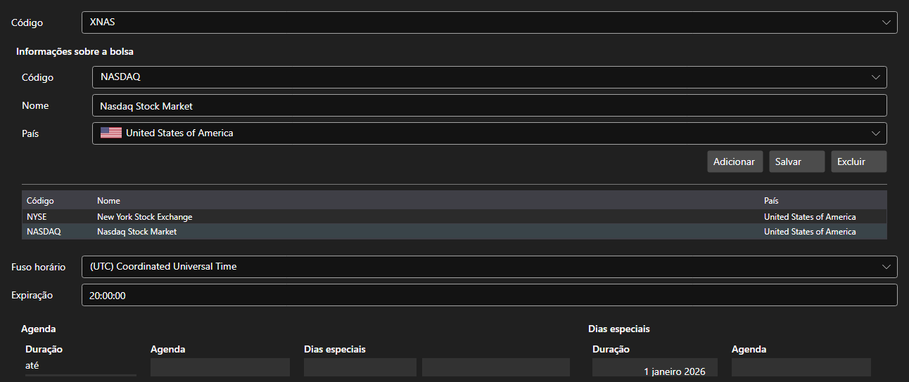

# Praças



[ExchangeBoardsPanel](xref:StockSharp.Xaml.ExchangeBoardsPanel) - um catálogo de praças [ExchangeBoard](xref:StockSharp.BusinessEntities.ExchangeBoard). Para cada praça define-se o código, a bolsa, o fuso horário e o horário de funcionamento.

**Propriedades principais**

- [ExchangeBoardsPanel.Boards](xref:StockSharp.Xaml.ExchangeBoardsPanel.Boards) - lista de praças.
- [ExchangeBoardsPanel.SelectedBoardCode](xref:StockSharp.Xaml.ExchangeBoardsPanel.SelectedBoardCode) - código da praça selecionada.

O horário é editado pelo [WorkingTimeControl](xref:StockSharp.Xaml.WorkingTimeControl) embutido. É desse horário que o teste sobre histórico descobre quando a praça está aberta e quando está fechada.

Abaixo estão fragmentos de código com seu uso:

```xaml
<Window x:Class="Sample.BoardsWindow"
	xmlns="http://schemas.microsoft.com/winfx/2006/xaml/presentation"
	xmlns:x="http://schemas.microsoft.com/winfx/2006/xaml"
	xmlns:xaml="http://schemas.stocksharp.com/xaml"
	Height="500" Width="800">
	<xaml:ExchangeBoardsPanel x:Name="BoardsPanel" />
</Window>
```

```cs
// Escolhemos a praça
BoardsPanel.SetBoardCode(ExchangeBoard.MicexTqbr.Code);

// Marcamos que o catálogo mudou
BoardsPanel.Changed += () => _isModified = true;

// Salvamos as praças
foreach (var board in BoardsPanel.Boards)
	_exchangeInfoProvider.Save(board);
```

## Veja também

[Painéis de serviço](../service_panels.md)
