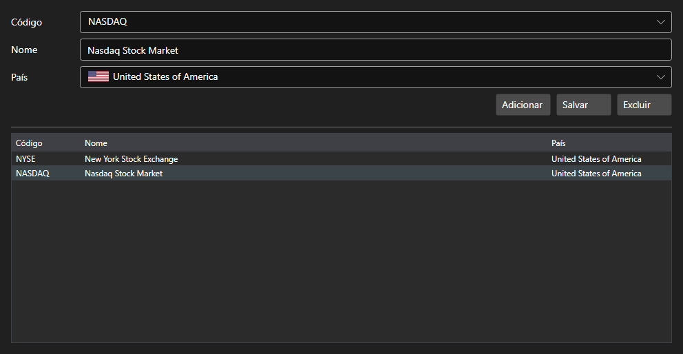

# Bolsas



[ExchangesPanel](xref:StockSharp.Xaml.ExchangesPanel) - um catálogo de bolsas. Mostra a lista de [Exchange](xref:StockSharp.BusinessEntities.Exchange) com o nome e o país e permite adicionar bolsas próprias.

**Propriedades principais**

- [ExchangesPanel.Exchanges](xref:StockSharp.Xaml.ExchangesPanel.Exchanges) - lista de bolsas [Exchange](xref:StockSharp.BusinessEntities.Exchange).
- [ExchangesPanel.SelectedExchangeName](xref:StockSharp.Xaml.ExchangesPanel.SelectedExchangeName) - nome da bolsa selecionada.

O painel costuma andar junto com o [ExchangeBoardsPanel](xref:StockSharp.Xaml.ExchangeBoardsPanel): a bolsa escolhida aqui define quais praças aparecem lá. O evento `SelectedExchangeChanged` informa a mudança de seleção.

Abaixo estão fragmentos de código com seu uso:

```xaml
<Window x:Class="Sample.ExchangesWindow"
	xmlns="http://schemas.microsoft.com/winfx/2006/xaml/presentation"
	xmlns:x="http://schemas.microsoft.com/winfx/2006/xaml"
	xmlns:xaml="http://schemas.stocksharp.com/xaml"
	Height="400" Width="600">
	<xaml:ExchangesPanel x:Name="ExchangesPanel" />
</Window>
```

```cs
// Escolhemos a bolsa
ExchangesPanel.SetExchange(Exchange.Moex.Name);

// Redefinimos a seleção de praça ao trocar de bolsa
ExchangesPanel.SelectedExchangeChanged += () =>
	BoardsPanel.SetBoardCode(null);

// Salvamos o catálogo
foreach (var exchange in ExchangesPanel.Exchanges)
	_exchangeInfoProvider.Save(exchange);
```

## Veja também

[Painéis de serviço](../service_panels.md)
