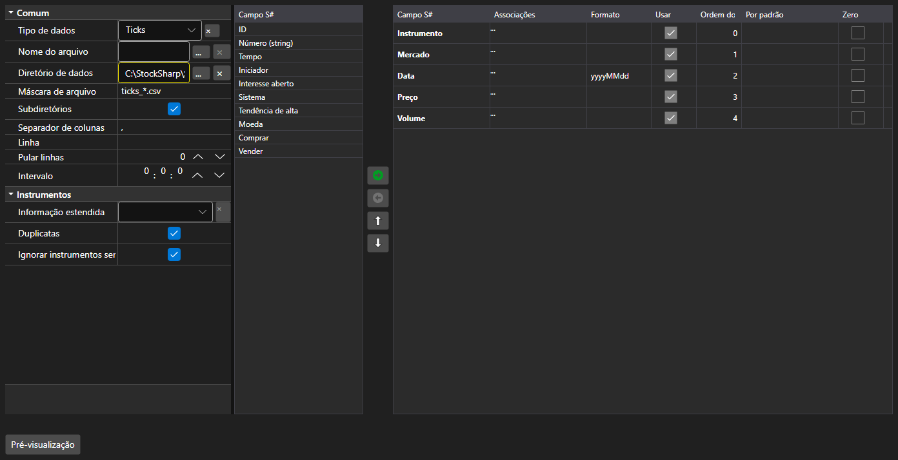

# Configurações de importação



[ImportSettingsPanel](xref:StockSharp.Xaml.ImportSettingsPanel) - um painel que configura a importação de dados de um arquivo de texto. Define o separador, o formato de data e hora, a codificação e, principalmente, o conjunto e a ordem das colunas.

**Propriedades principais**

- [ImportSettingsPanel.Settings](xref:StockSharp.Xaml.ImportSettingsPanel.Settings) - configurações de importação.
- [ImportSettingsPanel.SelectedFields](xref:StockSharp.Xaml.ImportSettingsPanel.SelectedFields) - campos selecionados na ordem em que aparecem no arquivo.
- [ImportSettingsPanel.UnSelectedFields](xref:StockSharp.Xaml.ImportSettingsPanel.UnSelectedFields) - campos que não estão no arquivo.

Os campos são movidos entre as duas listas e reordenados para cima e para baixo até que a ordem coincida com a das colunas do arquivo. O método [ImportSettingsPanel.HasErrors](xref:StockSharp.Xaml.ImportSettingsPanel.HasErrors) valida as configurações antes do início da importação.

Abaixo estão fragmentos de código com seu uso:

```xaml
<Window x:Class="Sample.ImportWindow"
	xmlns="http://schemas.microsoft.com/winfx/2006/xaml/presentation"
	xmlns:x="http://schemas.microsoft.com/winfx/2006/xaml"
	xmlns:xaml="http://schemas.stocksharp.com/xaml"
	Height="600" Width="900">
	<xaml:ImportSettingsPanel x:Name="ImportPanel" />
</Window>
```

```cs
// Configuramos a importação de ticks
ImportPanel.Settings = new ImportSettings(DataType.Ticks, fields);

// Não iniciamos a importação com configurações inválidas
if (ImportPanel.HasErrors())
	return;

// Criamos o analisador com os campos configurados
var parser = new CsvParser(ImportPanel.Settings.DataType, ImportPanel.SelectedFields);
```

## Veja também

[Painéis de serviço](../service_panels.md)
