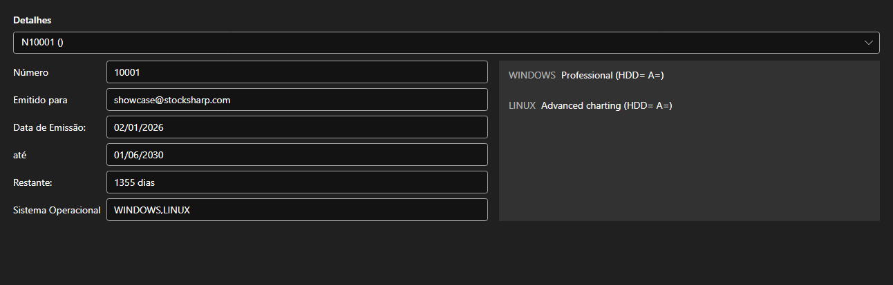

# Licenças



[LicensePanel](xref:StockSharp.Xaml.LicensePanel) - um painel de licenças instaladas. A licença é escolhida na lista de cima; abaixo ficam seu número, para quem foi emitida, as datas de emissão e de expiração, quantos dias restam e os sistemas operacionais suportados, e à direita os recursos que ela permite.

**Propriedades principais**

- [LicensePanel.Licenses](xref:StockSharp.Xaml.LicensePanel.Licenses) - lista de licenças.

O painel é embutido na janela «Sobre» e no assistente de primeira execução: vê-se na hora qual licença está expirando e quais recursos faltam.

Abaixo estão fragmentos de código com seu uso:

```xaml
<Window x:Class="Sample.LicenseWindow"
	xmlns="http://schemas.microsoft.com/winfx/2006/xaml/presentation"
	xmlns:x="http://schemas.microsoft.com/winfx/2006/xaml"
	xmlns:xaml="http://schemas.stocksharp.com/xaml"
	Height="400" Width="800">
	<xaml:LicensePanel x:Name="LicensePanel" />
</Window>
```

```cs
// Mostramos as licenças instaladas
LicensePanel.Licenses = LicenseHelper.Licenses;
```

## Veja também

[Painéis de serviço](../service_panels.md)
