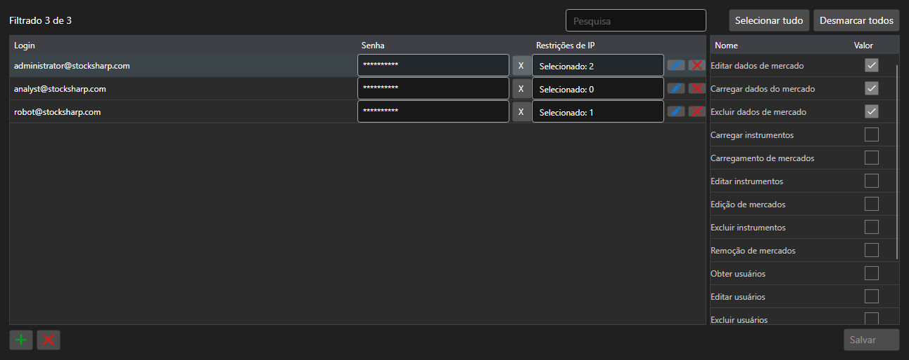

# Contas e permissões



[PermissionCredentialsPanel](xref:StockSharp.Xaml.PermissionCredentialsPanel) - uma tabela de contas do servidor com permissões de acesso. Para cada entrada marca-se quais operações são permitidas: baixar dados, editar, registrar ordens, administrar o servidor.

**Propriedades principais**

- [PermissionCredentialsPanel.Credentials](xref:StockSharp.Xaml.PermissionCredentialsPanel.Credentials) - lista de contas.
- [PermissionCredentialsPanel.ChangedCredentials](xref:StockSharp.Xaml.PermissionCredentialsPanel.ChangedCredentials) - entradas alteradas desde o último salvamento.
- [PermissionCredentialsPanel.SaveText](xref:StockSharp.Xaml.PermissionCredentialsPanel.SaveText) - texto do botão de salvar.

O painel não salva as entradas \- pelo botão ele dispara o evento `Saving`, a aplicação grava as contas alteradas e chama [PermissionCredentialsPanel.MarkSaved](xref:StockSharp.Xaml.PermissionCredentialsPanel.MarkSaved), após o que a lista de alterações é limpa.

Abaixo estão fragmentos de código com seu uso:

```xaml
<Window x:Class="Sample.CredentialsWindow"
	xmlns="http://schemas.microsoft.com/winfx/2006/xaml/presentation"
	xmlns:x="http://schemas.microsoft.com/winfx/2006/xaml"
	xmlns:xaml="http://schemas.stocksharp.com/xaml"
	Height="500" Width="900">
	<xaml:PermissionCredentialsPanel x:Name="CredentialsPanel" />
</Window>
```

```cs
// Mostramos as contas do servidor
CredentialsPanel.Credentials.AddRange(_server.Credentials);

// Salvamos apenas as entradas alteradas
CredentialsPanel.Saving += () =>
{
	foreach (var credentials in CredentialsPanel.ChangedCredentials)
		_server.Save(credentials);

	// Limpamos a lista de alterações
	CredentialsPanel.MarkSaved();
};
```

## Veja também

[Painéis de serviço](../service_panels.md)
