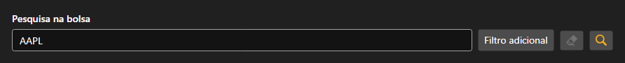

# Busca de instrumentos



[SecurityLookupPanel](xref:StockSharp.Xaml.SecurityLookupPanel) - um painel de busca de instrumentos. Na caixa digita-se o código ou parte dele e, atrás do botão de filtro adicional, abre-se um editor de [Security](xref:StockSharp.BusinessEntities.Security) onde se definem o tipo, a praça, a moeda e a data de vencimento.

O painel não busca nada sozinho \- pelo botão de busca ou pela tecla enter ele dispara o evento `Lookup` com o filtro preenchido. O que fazer em seguida \- enviar a consulta ao conector ou procurar no armazenamento local \- cabe à aplicação.

Abaixo estão fragmentos de código com seu uso:

```xaml
<Window x:Class="Sample.LookupWindow"
	xmlns="http://schemas.microsoft.com/winfx/2006/xaml/presentation"
	xmlns:x="http://schemas.microsoft.com/winfx/2006/xaml"
	xmlns:xaml="http://schemas.stocksharp.com/xaml"
	Height="500" Width="400">
	<xaml:SecurityLookupPanel x:Name="LookupPanel" />
</Window>
```

```cs
// Enviamos a consulta de busca ao conector
LookupPanel.Lookup += filter =>
{
	// O filtro chega preenchido
	_connector.Subscribe(new Subscription(filter.ToLookupMessage()));
};

// Mostramos os instrumentos encontrados na tabela
_connector.SecurityReceived += (subscription, security) =>
	this.GuiAsync(() => SecurityGrid.Securities.Add(security));
```

## Veja também

[Painéis de serviço](../service_panels.md)
