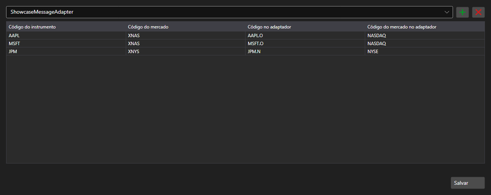

# Correspondência de códigos de instrumentos



[SecurityMappingPanel](xref:StockSharp.Xaml.SecurityMappingPanel) - uma tabela de correspondências entre o código do instrumento no sistema e o código dele em um conector específico. Resolve o problema habitual: o mesmo contrato tem nomes diferentes em cada provedor de dados.

**Propriedades principais**

- [SecurityMappingPanel.ConnectorsInfo](xref:StockSharp.Xaml.SecurityMappingPanel.ConnectorsInfo) - lista de conectores para os quais as correspondências são definidas.
- [SecurityMappingPanel.Storage](xref:StockSharp.Xaml.SecurityMappingPanel.Storage) - armazenamento das correspondências.
- [SecurityMappingPanel.SaveText](xref:StockSharp.Xaml.SecurityMappingPanel.SaveText) - texto do botão de salvar.

As linhas são adicionadas e removidas na própria tabela e, ao pressionar o botão de salvar, o evento `Saving` é disparado \- a aplicação grava as alterações no armazenamento e muda o texto do botão.

Abaixo estão fragmentos de código com seu uso:

```xaml
<Window x:Class="Sample.MappingWindow"
	xmlns="http://schemas.microsoft.com/winfx/2006/xaml/presentation"
	xmlns:x="http://schemas.microsoft.com/winfx/2006/xaml"
	xmlns:xaml="http://schemas.stocksharp.com/xaml"
	Height="500" Width="900">
	<xaml:SecurityMappingPanel x:Name="MappingPanel" />
</Window>
```

```cs
// Definimos o armazenamento das correspondências
MappingPanel.Storage = _securityMappingStorage;

// Adicionamos um conector à lista
MappingPanel.ConnectorsInfo.Add(new ConnectorInfo("Binance"));

// Confirmamos o salvamento pelo texto do botão
MappingPanel.Saving += () => MappingPanel.SaveText = LocalizedStrings.Saved;
```

## Veja também

[Painéis de serviço](../service_panels.md)
