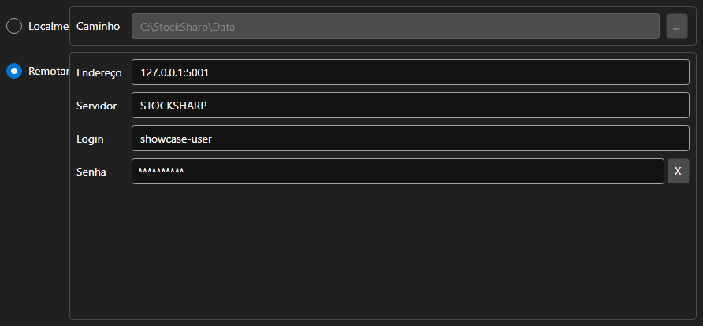

# Configurações do armazenamento



[StorageSettingsPanel](xref:StockSharp.Xaml.StorageSettingsPanel) - um painel para escolher o armazenamento de dados de mercado. Alterna entre uma pasta local e um servidor remoto e define os parâmetros da opção escolhida.

**Propriedades principais**

- [StorageSettingsPanel.IsLocal](xref:StockSharp.Xaml.StorageSettingsPanel.IsLocal) - usar o armazenamento local.
- [StorageSettingsPanel.Path](xref:StockSharp.Xaml.StorageSettingsPanel.Path) - caminho da pasta do armazenamento local.
- [StorageSettingsPanel.Address](xref:StockSharp.Xaml.StorageSettingsPanel.Address) - endereço do servidor remoto.
- [StorageSettingsPanel.Login](xref:StockSharp.Xaml.StorageSettingsPanel.Login) - nome de usuário para o servidor remoto.
- [StorageSettingsPanel.IsCredentialsEnabled](xref:StockSharp.Xaml.StorageSettingsPanel.IsCredentialsEnabled) - disponibilidade dos campos de usuário e senha.

Qualquer alteração dispara o evento `SettingsChanged`, com o qual a aplicação recria o [IMarketDataDrive](xref:StockSharp.Algo.Storages.IMarketDataDrive).

Abaixo estão fragmentos de código com seu uso:

```xaml
<Window x:Class="Sample.StorageWindow"
	xmlns="http://schemas.microsoft.com/winfx/2006/xaml/presentation"
	xmlns:x="http://schemas.microsoft.com/winfx/2006/xaml"
	xmlns:xaml="http://schemas.stocksharp.com/xaml"
	Height="300" Width="500">
	<xaml:StorageSettingsPanel x:Name="StoragePanel" />
</Window>
```

```cs
// Escolhemos a pasta local
StoragePanel.IsLocal = true;
StoragePanel.Path = @"C:\Data";

// Marcamos que as configurações mudaram
StoragePanel.SettingsChanged += () => _isModified = true;

// Criamos o armazenamento conforme as configurações do painel
var drive = StoragePanel.IsLocal
	? new LocalMarketDataDrive(StoragePanel.Path)
	: (IMarketDataDrive)new RemoteMarketDataDrive(StoragePanel.Address.To<EndPoint>());
```

## Veja também

[Painéis de serviço](../service_panels.md)
