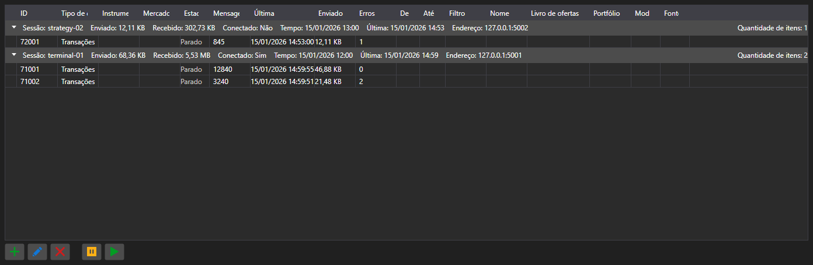

# Assinaturas



[SubscriptionPanel](xref:StockSharp.Xaml.SubscriptionPanel) - uma tabela de assinaturas ativas agrupada por sessões. Para cada assinatura mostra o tipo de dados, a quantidade de mensagens, a hora da última mensagem, a quantidade de erros e o volume de dados transferidos.

**Propriedades principais**

- [SubscriptionPanel.Subscriptions](xref:StockSharp.Xaml.SubscriptionPanel.Subscriptions) - lista de assinaturas.
- [SubscriptionPanel.Sessions](xref:StockSharp.Xaml.SubscriptionPanel.Sessions) - lista de sessões.
- [SubscriptionPanel.SelectedSubscriptions](xref:StockSharp.Xaml.SubscriptionPanel.SelectedSubscriptions) - assinaturas selecionadas.

O painel é usado do lado do servidor: mostra quem está conectado, o que solicita e quantos dados recebe. As ações sobre as linhas \- adicionar, alterar, remover, suspender \- disparam os eventos de mesmo nome e quem as executa é a aplicação.

Abaixo estão fragmentos de código com seu uso:

```xaml
<Window x:Class="Sample.SubscriptionsWindow"
	xmlns="http://schemas.microsoft.com/winfx/2006/xaml/presentation"
	xmlns:x="http://schemas.microsoft.com/winfx/2006/xaml"
	xmlns:xaml="http://schemas.stocksharp.com/xaml"
	Height="400" Width="1000">
	<xaml:SubscriptionPanel x:Name="SubscriptionPanel" />
</Window>
```

```cs
// Registramos a sessão do cliente
SubscriptionPanel.AddSession(sessionId, new SessionInfo(sessionId, DateTime.UtcNow, address));

// Adicionamos a assinatura à tabela
SubscriptionPanel.Subscriptions.Add(new SubscriptionInfo(session, subscription));

// Cancelamos a assinatura por comando da tabela
SubscriptionPanel.SubscriptionRemoving += info => _connector.UnSubscribe(info.Subscription);
```

## Veja também

[Painéis de serviço](../service_panels.md)
