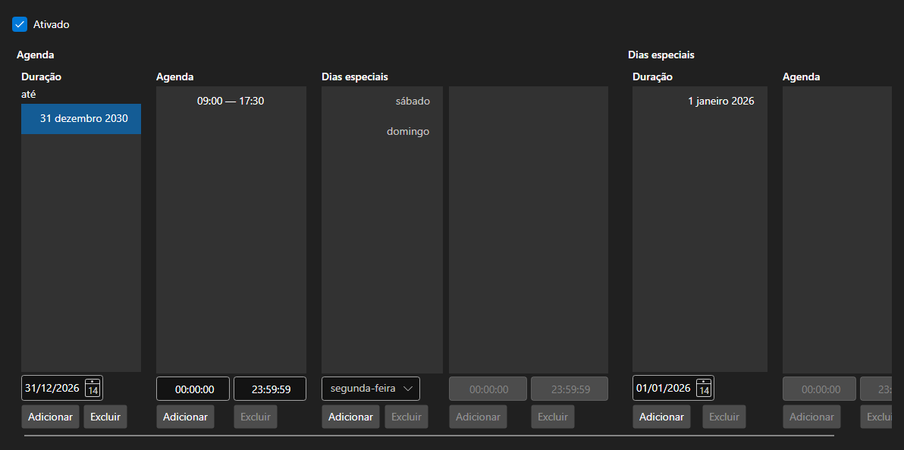

# Horário de funcionamento



[WorkingTimeControl](xref:StockSharp.Xaml.WorkingTimeControl) - um editor do horário [WorkingTime](xref:StockSharp.Messages.WorkingTime). Define os períodos de vigência, os horários por dia da semana e os dias especiais \- feriados e transferências.

**Propriedades principais**

- [WorkingTimeControl.WorkingTime](xref:StockSharp.Xaml.WorkingTimeControl.WorkingTime) - horário editado.
- [WorkingTimeControl.ShowActive](xref:StockSharp.Xaml.WorkingTimeControl.ShowActive) - indicação do período vigente.

Um horário é composto de períodos, cada um com seu conjunto de horas por dia da semana. As horas são editadas como uma lista de intervalos e os erros \- intervalos sobrepostos, um fim anterior ao início \- são informados pelo evento `Error`.

Abaixo estão fragmentos de código com seu uso:

```xaml
<Window x:Class="Sample.WorkingTimeWindow"
	xmlns="http://schemas.microsoft.com/winfx/2006/xaml/presentation"
	xmlns:x="http://schemas.microsoft.com/winfx/2006/xaml"
	xmlns:xaml="http://schemas.stocksharp.com/xaml"
	Height="500" Width="700">
	<xaml:WorkingTimeControl x:Name="WorkingTimeControl" />
</Window>
```

```cs
// Mostramos o horário da praça
WorkingTimeControl.WorkingTime = ExchangeBoard.MicexTqbr.WorkingTime;

// Mostramos o erro ao lado do editor
WorkingTimeControl.Error += (message, isError) => ShowStatus(message, isError);

// Marcamos que o horário mudou
WorkingTimeControl.DataChanged += () => _isModified = true;
```

## Veja também

[Painéis de serviço](../service_panels.md)
