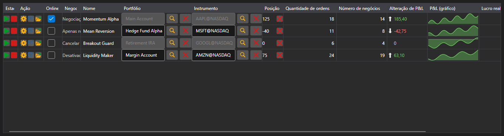

# Monitor de estratégias



[StrategiesDashboard](xref:StockSharp.Xaml.StrategiesDashboard) - uma tabela de estratégias em execução simultânea. Uma linha mostra o instrumento, o portfólio, o estado, a posição, o lucro, a quantidade de ordens e negócios e os botões de controle.

**Propriedades principais**

- [StrategiesDashboard.Items](xref:StockSharp.Xaml.StrategiesDashboard.Items) - lista de linhas do monitor.
- [StrategiesDashboard.SecurityProvider](xref:StockSharp.Xaml.StrategiesDashboard.SecurityProvider) - provedor de instrumentos para a coluna de instrumento.
- [StrategiesDashboard.Portfolios](xref:StockSharp.Xaml.StrategiesDashboard.Portfolios) - fonte de portfólios para a coluna de portfólio.

Uma linha do monitor é um [IStrategiesDashboardItem](xref:StockSharp.Xaml.IStrategiesDashboardItem) e não a estratégia em si: os botões de iniciar, parar, fechar posição, configurações e regras de risco funcionam pelos comandos dessa interface. Por isso o monitor serve tanto para estratégias locais quanto para as que rodam em servidor.

Abaixo estão fragmentos de código com seu uso:

```xaml
<Window x:Class="Sample.DashboardWindow"
	xmlns="http://schemas.microsoft.com/winfx/2006/xaml/presentation"
	xmlns:x="http://schemas.microsoft.com/winfx/2006/xaml"
	xmlns:xaml="http://schemas.stocksharp.com/xaml"
	Height="400" Width="1100">
	<xaml:StrategiesDashboard x:Name="Dashboard" />
</Window>
```

```cs
// Definimos as fontes para as colunas de instrumento e portfólio
Dashboard.SecurityProvider = _connector;
Dashboard.Portfolios = new PortfolioDataSource(_connector);

// Adicionamos linhas do monitor para nossas estratégias
foreach (var strategy in _strategies)
	Dashboard.Items.Add(new StrategyDashboardItem(strategy));

// Removemos do monitor a estratégia parada
Dashboard.Items.Remove(Dashboard.Items.First(i => i.ProcessState == ProcessStates.Stopped));
```

## Veja também

[Estratégias](../strategies.md)
