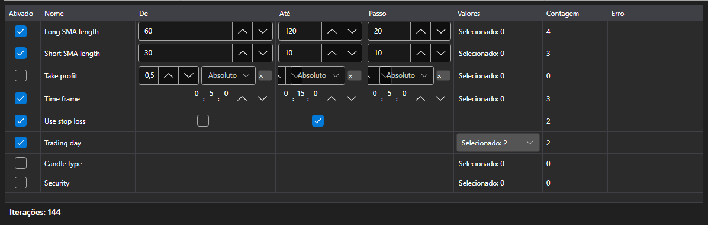

# Parâmetros de otimização



[OptimizationParametersPanel](xref:StockSharp.Xaml.OptimizationParametersPanel) \- o editor dos parâmetros pelos quais corre o varrimento. Uma linha \- um parâmetro da estratégia: a caixa de seleção inclui-o no varrimento, a seguir vêm os limites e o passo ou a lista de valores e, sob a tabela, fica o total: quantas execuções o conjunto atual produz.

**Propriedades principais**

- [OptimizationParametersPanel.Parameters](xref:StockSharp.Xaml.OptimizationParametersPanel.Parameters) \- as linhas do editor. Serve qualquer coleção de [IOptimizationParameterRow](xref:StockSharp.Xaml.IOptimizationParameterRow), por isso cada aplicação pode ter o seu próprio modelo de parâmetro.
- [OptimizationParametersPanel.MaxIterations](xref:StockSharp.Xaml.OptimizationParametersPanel.MaxIterations) \- o limite do número de execuções; zero significa que não há limite.
- [OptimizationParametersPanel.TotalCount](xref:StockSharp.Xaml.OptimizationParametersPanel.TotalCount) \- quantas execuções o conjunto atual produz: o produto do número de valores de todos os parâmetros incluídos, truncado pelo limite.
- [OptimizationParametersPanel.FirstProblem](xref:StockSharp.Xaml.OptimizationParametersPanel.FirstProblem) \- o primeiro motivo pelo qual o conjunto não pode ser iniciado.

O conjunto de valores depende do tipo do parâmetro: num número e num [TimeSpan](xref:System.TimeSpan) são os limites e o passo; num [bool](xref:System.Boolean) \- dois valores; numa enumeração, num [Security](xref:StockSharp.BusinessEntities.Security) e num [DataType](xref:StockSharp.Messages.DataType) \- uma lista explícita. A linha que não pode ser percorrida (passo igual a zero, limites por definir, lista vazia) explica o motivo na própria tabela, e o contador final não conta essa linha.

O número de execuções cresce por produto e não por soma: três parâmetros com cinco valores cada \- são 125 execuções e não 15. Por isso o contador fica ao lado da tabela e não no passo seguinte do assistente.

Abaixo estão fragmentos de código com seu uso:

```xaml
<Window x:Class="Sample.OptimizationWindow"
	xmlns="http://schemas.microsoft.com/winfx/2006/xaml/presentation"
	xmlns:x="http://schemas.microsoft.com/winfx/2006/xaml"
	xmlns:xaml="http://schemas.stocksharp.com/xaml"
	Height="400" Width="700">
	<xaml:OptimizationParametersPanel x:Name="ParametersPanel" />
</Window>
```

```cs
// As linhas do editor são o modelo da aplicação que implementa IOptimizationParameterRow
ParametersPanel.Parameters = _rows;

// Limite do número de execuções
ParametersPanel.MaxIterations = 5000;

// Pode iniciar-se quando o conjunto não está vazio e não tem erros
StartButton.IsEnabled = ParametersPanel.TotalCount > 0 && ParametersPanel.FirstProblem.Length == 0;
```

## Veja também

[Estratégias](../strategies.md)

[Resultados da otimização](optimization_results.md)
