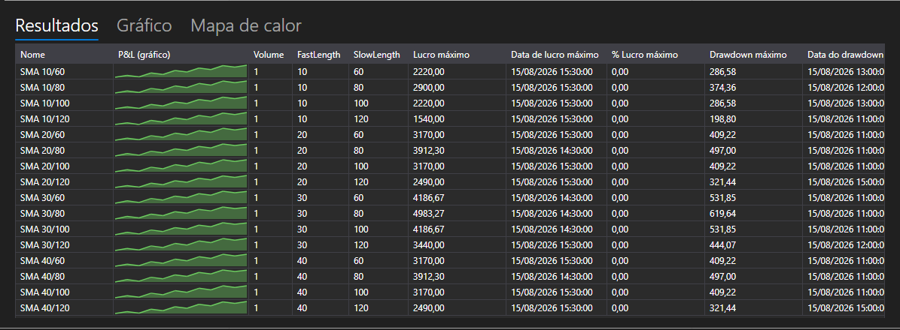

# Resultados da otimização



[OptimizationResultsPanel](xref:StockSharp.Xaml.Charting.OptimizationResultsPanel) \- três formas de ler os resultados do varrimento, reunidas num só componente:

- **Resultados** \- a tabela das execuções: os valores dos parâmetros, as estatísticas e o gráfico de P&L de cada execução ao lado dos seus números. É o [StrategiesStatisticsPanel](xref:StockSharp.Xaml.StrategiesStatisticsPanel), por isso as colunas ordenam-se e configuram-se como em todo o lado.
- **Gráfico** \- uma superfície tridimensional sobre dois parâmetros: os eixos escolhem-se nas listas por cima do gráfico e a altura \- o indicador estatístico escolhido.
- **Mapa de calor** \- a mesma superfície vista de cima. Os eixos definem-se uma única vez, no gráfico, e o mapa repete-os.

**Propriedades principais**

- [OptimizationResultsPanel.ViewModel](xref:StockSharp.Xaml.Charting.OptimizationResultsPanel.ViewModel) \- os resultados a partir dos quais se desenham as três superfícies.

As execuções são adicionadas ao [OptimizationResultsViewModel](xref:StockSharp.Xaml.Charting.OptimizationResultsViewModel) no momento do arranque e não no fim: a linha aparece de imediato na tabela e passa a acompanhar a sua estratégia, por isso a execução em curso vê-se nas três superfícies.

- [OptimizationResultsViewModel.AddRun](xref:StockSharp.Xaml.Charting.OptimizationResultsViewModel.AddRun(StockSharp.Algo.Strategies.Strategy,System.Collections.Generic.IEnumerable{StockSharp.Algo.Strategies.IStrategyParam})) \- adiciona uma execução. A primeira execução define as colunas da tabela e o que os eixos oferecem.
- [OptimizationResultsViewModel.Refresh](xref:StockSharp.Xaml.Charting.OptimizationResultsViewModel.Refresh) \- redesenha as superfícies quando o que foi medido mudou.
- [OptimizationResultsViewModel.Clear](xref:StockSharp.Xaml.Charting.OptimizationResultsViewModel.Clear) \- repõe as execuções antes de um novo varrimento.

Uma combinação de parâmetros \- um ponto da superfície. Se a combinação correu várias vezes, o ponto mostra a média; se a combinação não correu de todo, o mapa de calor preenche-a com o menor valor, para que a lacuna não pareça um cume.

Abaixo estão fragmentos de código com seu uso:

```xaml
<Window x:Class="Sample.OptimizationResultsWindow"
	xmlns="http://schemas.microsoft.com/winfx/2006/xaml/presentation"
	xmlns:x="http://schemas.microsoft.com/winfx/2006/xaml"
	xmlns:charting="http://schemas.stocksharp.com/xaml"
	Height="600" Width="900">
	<charting:OptimizationResultsPanel x:Name="ResultsPanel" />
</Window>
```

```cs
_results = new OptimizationResultsViewModel();
ResultsPanel.ViewModel = _results;

// O otimizador comunica a execução no momento do seu arranque
_optimizer.StrategyInitialized += (strategy, parameters) =>
	this.GuiAsync(() => _results.AddRun(strategy, parameters));
```

## Veja também

[Estratégias](../strategies.md)

[Parâmetros de otimização](optimization_parameters.md)
