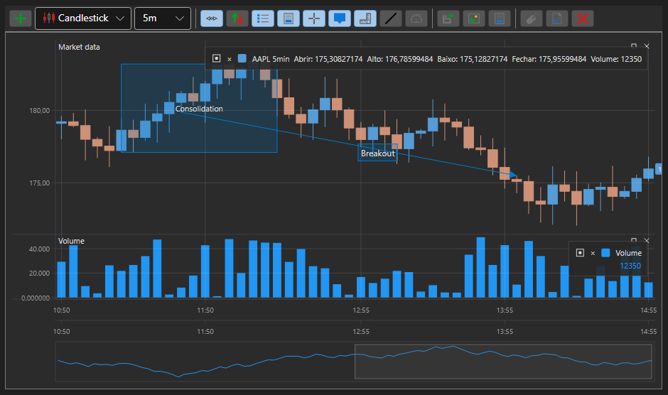

# Temas dos componentes gráficos S#

Para todos os elementos gráficos S#, existem vários temas diferentes. Abaixo estão os dois temas mais populares.




Para instalar o tema da aplicação, basta escrever uma linha. Por exemplo, para definir o tema escuro VisualStudio 2017, é necessário especificar a linha:

```cs
...
ThemeExtensions.ApplyDefaultTheme();
...
```

Como todos os elementos gráficos S# se baseiam nos elementos gráficos **DevExpress**, é necessário adicionar as bibliotecas **DevExpress** adequadas (**DevExpress.Xpf.Core**, **DevExpress.Xpf.Themes.VS2017Dark**, etc.)
