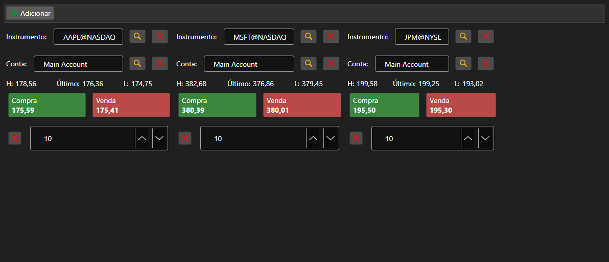

# Conjunto de painéis Comprar\/Vender



[BuySellGrid](xref:StockSharp.Xaml.BuySellGrid) - um contêiner de vários painéis [BuySellPanel](xref:StockSharp.Xaml.BuySellPanel), um por instrumento. Permite negociar vários instrumentos em uma única tela.

**Propriedades principais**

- [BuySellGrid.SecurityProvider](xref:StockSharp.Xaml.BuySellGrid.SecurityProvider) - provedor de instrumentos para seleção nos painéis.
- [BuySellGrid.Portfolios](xref:StockSharp.Xaml.BuySellGrid.Portfolios) - fonte de portfólios.
- [BuySellGrid.MarketDataProvider](xref:StockSharp.Xaml.BuySellGrid.MarketDataProvider) - provedor de dados de mercado do qual os painéis obtêm os melhores preços.
- [BuySellGrid.Panels](xref:StockSharp.Xaml.BuySellGrid.Panels) - conjunto atual de painéis.

Os painéis são adicionados por [BuySellGrid.AddPanel](xref:StockSharp.Xaml.BuySellGrid.AddPanel(StockSharp.BusinessEntities.Security)) e removidos por [BuySellGrid.RemovePanel](xref:StockSharp.Xaml.BuySellGrid.RemovePanel(StockSharp.Xaml.BuySellPanel)). O contêiner não registra ordens \- ele dispara o evento `OrderRegistering` com instrumento, portfólio, direção, preço e volume. A composição dos painéis é salva e restaurada por `Save` e `Load`.

Abaixo estão fragmentos de código com seu uso:

```xaml
<Window x:Class="Sample.BuySellWindow"
	xmlns="http://schemas.microsoft.com/winfx/2006/xaml/presentation"
	xmlns:x="http://schemas.microsoft.com/winfx/2006/xaml"
	xmlns:xaml="http://schemas.stocksharp.com/xaml"
	Height="400" Width="900">
	<xaml:BuySellGrid x:Name="BuySellGrid" />
</Window>
```

```cs
// Definimos as fontes de dados para todos os painéis
BuySellGrid.SecurityProvider = _connector;
BuySellGrid.MarketDataProvider = _connector;
BuySellGrid.Portfolios = new PortfolioDataSource(_connector);

// Adicionamos um painel para o instrumento
BuySellGrid.AddPanel(_security);

// Registramos a ordem formada pelo painel
BuySellGrid.OrderRegistering += (security, portfolio, side, price, volume) =>
{
	_connector.RegisterOrder(new Order
	{
		Security = security,
		Portfolio = portfolio,
		Side = side,
		Price = price,
		Volume = volume,
	});
};
```

## Veja também

[Negociação](../trading.md)
