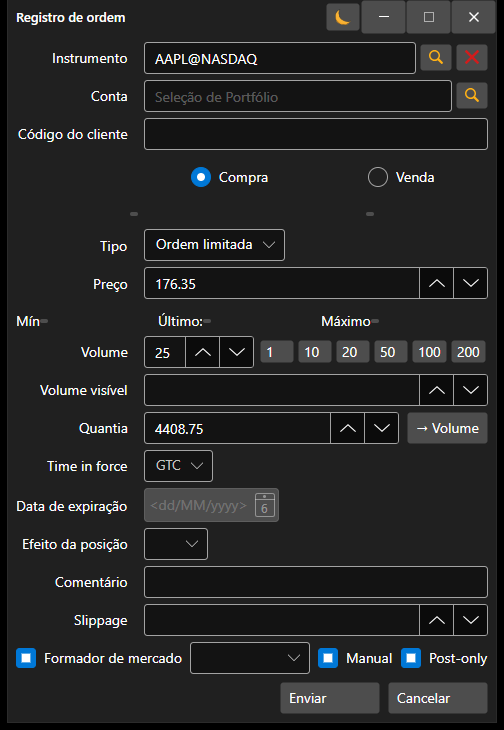

# Criação de nova ordem

[OrderWindow](xref:StockSharp.Xaml.OrderWindow) - janela para criar uma ordem.



Se a ligação suportar o registo de uma ordem condicional (stop-loss, take-profit), então nesta janela pode registar uma ordem condicional com condições avançadas definindo a opção **Condições avançadas**.

**Propriedades básicas**

- [OrderWindow.Portfolios](xref:StockSharp.Xaml.OrderWindow.Portfolios) - lista de portfólios.
- [OrderWindow.MarketDataProvider](xref:StockSharp.Xaml.OrderWindow.MarketDataProvider) - fornecedor de dados de mercado.
- [OrderWindow.SecurityProvider](xref:StockSharp.Xaml.OrderWindow.SecurityProvider) - fornecedor de informações sobre instrumentos.
- [OrderWindow.Order](xref:StockSharp.Xaml.OrderWindow.Order) - ordem criada.

Os fragmentos de código que a utilizam são apresentados abaixo. Exemplo de código retirado de *Samples\/01\_Basic\/03\_Orders*.

```cs
...
private readonly Connector _connector = new Connector();
...
private void NewOrderClick(object sender, RoutedEventArgs e)
{
	var wnd = new OrderWindow
	{
		Order = new Order { Security = SecurityPicker.SelectedSecurity },
		SecurityProvider = _connector,
		MarketDataProvider = _connector,
		Portfolios = new PortfolioDataSource(_connector),
	};
	if (wnd.ShowModal(this))
		_connector.RegisterOrder(wnd.Order);
}
						
	  				
```
