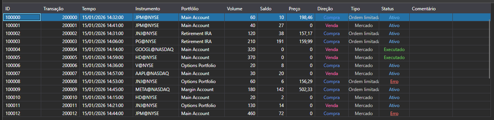

# Ordens

[OrderGrid](xref:StockSharp.Xaml.OrderGrid) é uma tabela para apresentar ordens e ordens condicionais. Além disso, o menu de contexto desta tabela contém comandos para operações com ordens: registo, substituição e cancelamento de ordens. A seleção de um item de menu gera os eventos: [OrderGrid.OrderRegistering](xref:StockSharp.Xaml.OrderGrid.OrderRegistering), [OrderGrid.OrderReRegistering](xref:StockSharp.Xaml.OrderGrid.OrderReRegistering) ou [OrderGrid.OrderCanceling](xref:StockSharp.Xaml.OrderGrid.OrderCanceling), respetivamente.



> [!TIP]
> A operação em si (registo, substituição, cancelamento) não é executada. O código correspondente tem de ser escrito manualmente nos manipuladores de eventos.

**Membros principais**

- [OrderGrid.Orders](xref:StockSharp.Xaml.OrderGrid.Orders) - lista de ordens.
- [OrderGrid.SelectedOrder](xref:StockSharp.Xaml.OrderGrid.SelectedOrder) - ordem selecionada.
- [OrderGrid.SelectedOrders](xref:StockSharp.Xaml.OrderGrid.SelectedOrders) - ordens selecionadas.
- [OrderGrid.AddRegistrationFail](xref:StockSharp.Xaml.OrderGrid.AddRegistrationFail(StockSharp.BusinessEntities.OrderFail))**(**[StockSharp.BusinessEntities.OrderFail](xref:StockSharp.BusinessEntities.OrderFail) fail **)** - método que adiciona uma mensagem de erro de registo de ordem ao campo de comentário.
- [OrderGrid.OrderRegistering](xref:StockSharp.Xaml.OrderGrid.OrderRegistering) - evento de registo de ordem (ocorre após selecionar o item correspondente do menu de contexto).
- [OrderGrid.OrderReRegistering](xref:StockSharp.Xaml.OrderGrid.OrderReRegistering) - evento de substituição de ordem (ocorre após selecionar o item correspondente do menu de contexto).
- [OrderGrid.OrderCanceling](xref:StockSharp.Xaml.OrderGrid.OrderCanceling) - evento de cancelamento de ordem (ocorre após selecionar o item correspondente do menu de contexto).

Abaixo estão fragmentos de código que mostram a sua utilização. O exemplo de código foi retirado de *Samples\/01\_Basic\/03\_Orders*.

```xaml
<Window x:Class="Sample.OrdersWindow"
	xmlns="http://schemas.microsoft.com/winfx/2006/xaml/presentation"
	xmlns:x="http://schemas.microsoft.com/winfx/2006/xaml"
	xmlns:loc="clr-namespace:StockSharp.Localization;assembly=StockSharp.Localization"
	xmlns:xaml="http://schemas.stocksharp.com/xaml"
	Title="{x:Static loc:LocalizedStrings.Orders}" Height="410" Width="930">
	<xaml:OrderGrid x:Name="OrderGrid" x:FieldModifier="public" 
					OrderCanceling="OrderGrid_OnOrderCanceling" 
					OrderReRegistering="OrderGrid_OnOrderReRegistering" />
</Window>
	  				
```
```cs
private readonly Connector _connector = new Connector();

private void ConnectClick(object sender, RoutedEventArgs e)
{
	// Outro código durante a conexão...
	
	// Assinar o evento de ordem recebida
	_connector.OrderReceived += (subscription, order) => 
	{
		// Adicionar ordens à tabela OrderGrid
		_ordersWindow.OrderGrid.Orders.TryAdd(order);
	};
	
	// Para conectar o conector
	_connector.Connect();
}
					
// Cancela todas as ordens selecionadas
private void OrderGrid_OnOrderCanceling(IEnumerable<Order> orders)
{
	// Iterar pelas ordens selecionadas e cancelar cada uma
	foreach (var order in orders)
	{
		_connector.CancelOrder(order);
	}
}

// Abre uma janela de edição de ordem e substitui a ordem selecionada
private void OrderGrid_OnOrderReRegistering(Order order)
{
	var window = new OrderWindow
	{
		Title = LocalizedStrings.Str2976Params.Put(order.TransactionId),
		SecurityProvider = _connector,
		MarketDataProvider = _connector,
		Portfolios = new PortfolioDataSource(_connector),
		Order = order.ReRegisterClone(newVolume: order.Balance)
	};
	
	if (window.ShowModal(this))
		_connector.ReRegisterOrder(order, window.Order);
}
	  				
```

## Trabalhar com ordens através de subscrições

A abordagem moderna para trabalhar com ordens envolve a utilização de subscrições:

```cs
// Assinar o evento de ordem recebida
_connector.OrderReceived += OnOrderReceived;

// Manipulador de ordem recebida
private void OnOrderReceived(Subscription subscription, Order order)
{
	// Verificar se a ordem pertence à assinatura de interesse
	if (subscription == _ordersSubscription)
	{
		// Adicionar ordem à tabela
		_ordersWindow.OrderGrid.Orders.TryAdd(order);
		
		// Processamento adicional da ordem
		Console.WriteLine($"Ordem recebida: {order.TransactionId}, Estado: {order.State}");
		
		// Se a ordem estiver num estado final, atualizar a UI
		if (order.State == OrderStates.Done || order.State == OrderStates.Failed)
		{
			this.GuiAsync(() => {
				// Atualizar interface para ordens concluídas
			});
		}
	}
}
```

## Cancelar ordens

```cs
// Abordagem moderna para cancelamento de ordens
private void CancelOrder(Order order)
{
	try
	{
		_connector.CancelOrder(order);
		
		// Registrar a ação
		_logManager.AddInfoLog($"Comando de cancelamento de ordem enviado: {order.TransactionId}");
	}
	catch (Exception ex)
	{
		_logManager.AddErrorLog($"Erro ao cancelar a ordem: {ex.Message}");
	}
}

// Cancelamento em massa de ordens
private void CancelAllOrders()
{
	var activeOrders = _ordersWindow.OrderGrid.Orders
		.Where(o => o.State == OrderStates.Active)
		.ToArray();
		
	foreach (var order in activeOrders)
	{
		CancelOrder(order);
	}
}
```

## Tratar erros de registo e cancelamento de ordens

```cs
// Assinar falhas de registro de ordens
_connector.OrderRegisterFailReceived += OnOrderRegisterFailed;

// Manipulador de falha de registro de ordem
private void OnOrderRegisterFailed(Subscription subscription, OrderFail fail)
{
	// Adicionar informações de erro ao OrderGrid
	_ordersWindow.OrderGrid.AddRegistrationFail(fail);
	
	// Registrar erro
	_logManager.AddErrorLog($"Erro ao registrar a ordem: {fail.Error}");
	
	// Notificar o usuário
	this.GuiAsync(() => 
	{
		MessageBox.Show(this, 
			$"Falha ao registrar a ordem: {fail.Error}",
			"Erro de registro",
			MessageBoxButton.OK, 
			MessageBoxImage.Error);
	});
}
```
