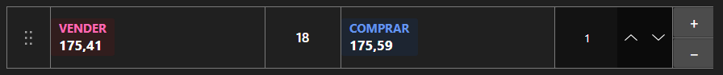

# Painel de negociação rápida



[QuickOrderPanel](xref:StockSharp.Xaml.QuickOrderPanel) - um painel compacto para registrar ordens com um clique. Mostra os melhores preços de compra e venda, o spread e o volume da ordem; ao clicar em um lado a ordem é formada imediatamente.

**Propriedades principais**

- [QuickOrderPanel.Security](xref:StockSharp.Xaml.QuickOrderPanel.Security) - instrumento para o qual as ordens são registradas.
- [QuickOrderPanel.Volume](xref:StockSharp.Xaml.QuickOrderPanel.Volume) - volume da ordem.
- [QuickOrderPanel.BuyBackground](xref:StockSharp.Xaml.QuickOrderPanel.BuyBackground) - fundo do lado de compra.
- [QuickOrderPanel.SellBackground](xref:StockSharp.Xaml.QuickOrderPanel.SellBackground) - fundo do lado de venda.

O painel não registra ordens sozinho \- apenas forma um objeto [Order](xref:StockSharp.BusinessEntities.Order) e o passa ao evento `RegisterOrder`. O portfólio e verificações adicionais entram no manipulador. Alterar o volume ou a aparência dispara `SettingsChanged`, ponto conveniente para salvar as configurações.

Abaixo estão fragmentos de código com seu uso:

```xaml
<Window x:Class="Sample.QuickOrderWindow"
	xmlns="http://schemas.microsoft.com/winfx/2006/xaml/presentation"
	xmlns:x="http://schemas.microsoft.com/winfx/2006/xaml"
	xmlns:xaml="http://schemas.stocksharp.com/xaml"
	Height="300" Width="260">
	<xaml:QuickOrderPanel x:Name="QuickOrderPanel" Volume="10" />
</Window>
```

```cs
// Definimos o instrumento - o painel assina seus melhores preços
QuickOrderPanel.Security = _security;

// O painel forma a ordem, nós mesmos a registramos
QuickOrderPanel.RegisterOrder += order =>
{
	order.Portfolio = _portfolio;
	_connector.RegisterOrder(order);
};

// Salvamos as configurações quando mudam
QuickOrderPanel.SettingsChanged += () => SaveSettings();
```

## Veja também

[Negociação](../trading.md)
