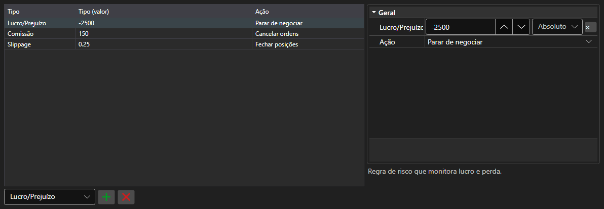

# Regras de gestão de risco



[RiskPanel](xref:StockSharp.Xaml.RiskPanel) - uma tabela de regras de gestão de risco. Permite adicionar, remover e configurar regras [IRiskRule](xref:StockSharp.Algo.Risk.IRiskRule): cada regra tem uma condição de disparo e uma ação.

**Propriedades principais**

- [RiskPanel.Rules](xref:StockSharp.Xaml.RiskPanel.Rules) - lista de regras; a mesma lista usada por [IRiskManager](xref:StockSharp.Algo.Risk.IRiskManager).

À esquerda fica a lista de regras: tipo, valor da condição e ação ao disparar. À direita, as propriedades da regra selecionada, diferentes para cada tipo. Uma regra nova é adicionada escolhendo o tipo na lista abaixo da tabela e uma desnecessária é removida pelo botão ao lado. A composição das colunas e suas larguras são salvas por `Save` e `Load`.

Abaixo estão fragmentos de código com seu uso:

```xaml
<Window x:Class="Sample.RiskWindow"
	xmlns="http://schemas.microsoft.com/winfx/2006/xaml/presentation"
	xmlns:x="http://schemas.microsoft.com/winfx/2006/xaml"
	xmlns:xaml="http://schemas.stocksharp.com/xaml"
	Height="400" Width="700">
	<xaml:RiskPanel x:Name="RiskPanel" />
</Window>
```

```cs
// Mostramos as regras do gestor de risco atual
RiskPanel.Rules.AddRange(_connector.RiskManager.Rules);

// Adicionamos uma regra: parar a negociação em caso de prejuízo
RiskPanel.Rules.Add(new RiskPnLRule
{
	PnL = -1000,
	Action = RiskActions.StopTrading,
});

// Devolvemos as regras editadas ao gestor de risco
_connector.RiskManager.Rules.Clear();
_connector.RiskManager.Rules.AddRange(RiskPanel.Rules);
```

## Veja também

[Negociação](../trading.md)
