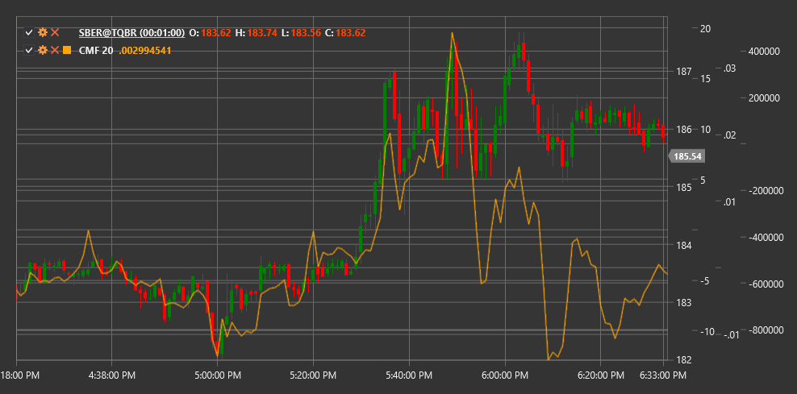

# CMF

**Chaikin Money Flow (CMF)** é um indicador técnico desenvolvido por Mark Chaikin que mede a força do fluxo monetário (acumulação e distribuição) no mercado durante um período específico.

Para usar o indicador, deve ser usada a classe [ChaikinMoneyFlow](xref:StockSharp.Algo.Indicators.ChaikinMoneyFlow).

## Descrição

Chaikin Money Flow (CMF) expande o conceito da Accumulation/Distribution Line (A/D Line), concentrando-se num período de tempo específico. O indicador mede o volume do fluxo monetário expresso como percentagem do volume total durante o período especificado.

CMF ajuda os traders a:
- Determinar a força da pressão compradora e vendedora
- Identificar tendências de acumulação (compra) e distribuição (venda)
- Detetar divergências entre o movimento do preço e o fluxo monetário
- Confirmar a tendência atual ou a sua fraqueza

A ideia principal do CMF é que, numa tendência ascendente forte, o preço de fecho deve estar mais próximo do máximo do período, enquanto numa tendência descendente forte deve estar mais próximo do mínimo do período.

## Parâmetros

O indicador tem os seguintes parâmetros:
- **Length** - período de cálculo (valor padrão: 20-21 dias)

## Cálculo

O cálculo do CMF envolve os seguintes passos:

1. Calcular o Money Flow Multiplier para cada período:
   ```
   Money Flow Multiplier = ((Close - Low) - (High - Close)) / (High - Low)
   ```
   
   Se (High - Low) = 0, então Money Flow Multiplier = 0.

2. Calcular o Money Flow Volume para o período:
   ```
   Money Flow Volume = Money Flow Multiplier * Volume
   ```

3. Calcular o Chaikin Money Flow:
   ```
   CMF = Sum(volume de fluxo monetário durante o período Length) / Sum(volume durante o período Length)
   ```

## Interpretação

O CMF oscila em torno da linha zero e normalmente fica no intervalo entre -1 e +1:

- **Valores positivos de CMF** (acima de zero):
  - Indicam pressão compradora (acumulação)
  - Quanto maior o valor, mais forte é a pressão compradora
  - Particularmente significativo se se mantiver durante um período prolongado

- **Valores negativos de CMF** (abaixo de zero):
  - Indicam pressão vendedora (distribuição)
  - Quanto menor o valor, mais forte é a pressão vendedora
  - A permanência prolongada na zona negativa confirma uma tendência descendente

- **Cruzamento da linha zero**:
  - O cruzamento de baixo para cima pode indicar o início de uma tendência ascendente
  - O cruzamento de cima para baixo pode sinalizar o início de uma tendência descendente

- **Divergências**:
  - Divergência bullish: o preço desce enquanto o CMF sobe (potencial reversão para cima)
  - Divergência bearish: o preço sobe enquanto o CMF desce (potencial reversão para baixo)

- **Níveis extremos**:
  - Valores acima de +0,25 podem indicar forte acumulação
  - Valores abaixo de -0,25 podem indicar forte distribuição



## Ver também

[ADL](accumulation_distribution_line.md)
[OBV](on_balance_volume.md)
[ForceIndex](force_index.md)
[MFI](money_flow_index.md)
