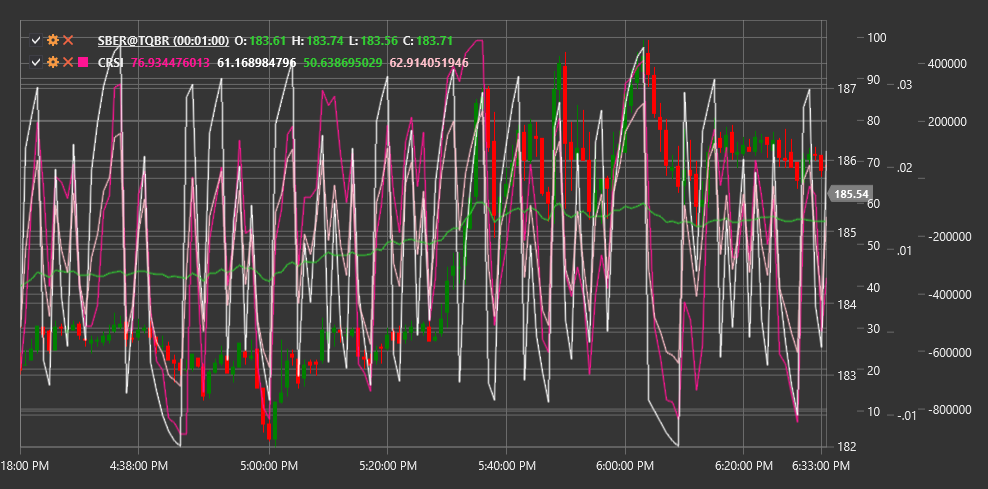

# CRSI

**Connors RSI (CRSI)** é um indicador técnico abrangente desenvolvido por Larry Connors que combina três componentes para medir condições de sobrecompra e sobrevenda no mercado.

Para usar o indicador, deve ser usada a classe [ConnorsRSI](xref:StockSharp.Algo.Indicators.ConnorsRSI).

## Descrição

Connors RSI é uma versão avançada do Relative Strength Index (RSI) tradicional, que adiciona dois componentes adicionais para fornecer sinais de sobrecompra e sobrevenda mais precisos.

Ao contrário do RSI padrão, que considera apenas a alteração do preço, Connors RSI também tem em conta a sequência (série de movimentos consecutivos do preço numa direção) e a taxa de variação (ROC), tornando-o mais sensível a alterações de curto prazo e mais fiável na identificação de condições extremas de mercado.

CRSI é particularmente útil para:
- Identificar oportunidades de entrada e saída de curto prazo
- Determinar níveis extremos de sobrecompra e sobrevenda
- Criar sistemas de trading baseados em reversão à média
- Filtrar sinais de outros indicadores

## Parâmetros

O indicador tem os seguintes parâmetros:
- **RSIPeriod** - período para calcular o componente RSI (valor predefinido: 3)
- **StreakRSIPeriod** - período para calcular o componente RSI da sequência (valor predefinido: 2)
- **ROCRSIPeriod** - período para calcular o componente RSI da taxa de variação (valor predefinido: 100)

## Cálculo

O cálculo do Connors RSI envolve três componentes que são depois promediados para obter o valor final:

1. **Componente Price RSI** - RSI padrão calculado ao longo de um curto período (normalmente 3 dias):
   ```
   RSI = 100 - (100 / (1 + RS))
   where RS = Average Positive Change / Average Negative Change
   ```

2. **Componente Streak RSI**:
   - Primeiro, calcular a sequência (número de dias consecutivos de subida ou queda do preço)
   - Depois aplicar RSI a esta sequência usando o StreakRSIPeriod

3. **Componente Rate of Change RSI (ROC RSI)**:
   - Calcular o Percentile Rank do ROC atual ao longo do ROCRSIPeriod
   - Escalar o Percentile Rank de 0 a 100

4. **Valor final de Connors RSI**:
   ```
   CRSI = (RSI + StreakRSI + ROCRSI) / 3
   ```

## Interpretação

Connors RSI oscila entre 0 e 100, de forma semelhante ao RSI padrão:

- **Valores extremamente elevados (acima de 90)** indicam fortes condições de sobrecompra. Isto pode ser um sinal para vender ou assumir uma posição short.

- **Valores extremamente baixos (abaixo de 10)** indicam fortes condições de sobrevenda. Isto pode ser um sinal para comprar ou fechar uma posição short.

- **Níveis padrão**:
  - Acima de 70-80: sobrecompra
  - Abaixo de 20-30: sobrevenda
  - 40-60: zona neutra

- **Divergências**:
  - Divergência bullish: o preço forma um novo mínimo, enquanto o CRSI forma um mínimo mais alto
  - Divergência bearish: o preço forma um novo máximo, enquanto o CRSI forma um máximo mais baixo

Connors RSI funciona melhor em gráficos com períodos diários a semanais e em estratégias de trading orientadas para reversão à média.



## Ver também

[RSI](rsi.md)
[RMI](relative_momentum_index.md)
[LRSI](laguerre_rsi.md)
