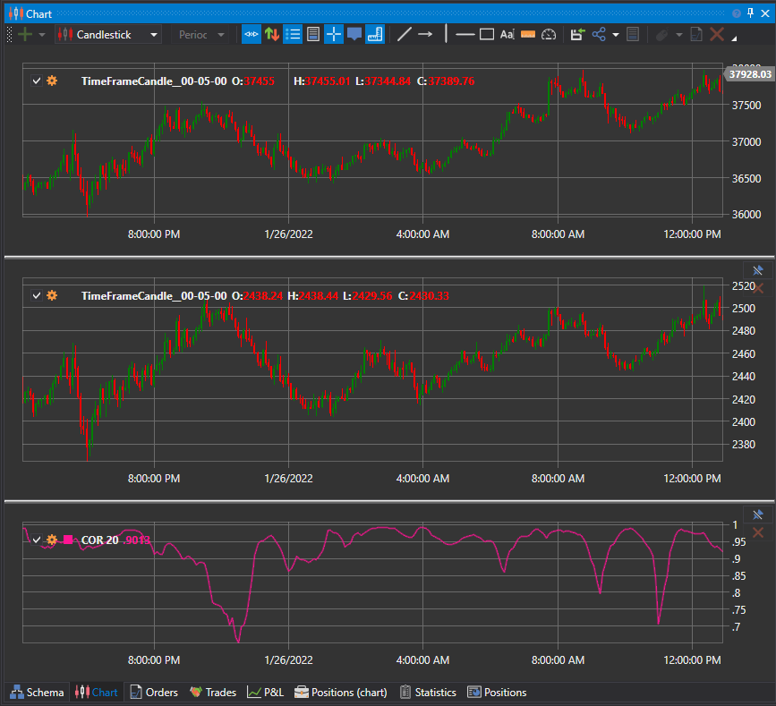

# Correlation

**Correlação** ou **dependência correlacional** é uma relação estatística entre duas ou mais variáveis aleatórias (ou variáveis que podem ser consideradas como tal com um certo grau de precisão), em que alterações nos valores de uma ou várias destas variáveis acompanham alterações sistemáticas nos valores de outra ou outras.

A medida matemática da correlação entre duas variáveis aleatórias é a razão de correlação ou coeficiente de correlação. Caracteriza a força da relação entre variáveis.

Coeficiente de Correlação
1. Pode assumir valores de -1 a +1.
2. O sinal do coeficiente indica a direção da relação (direta ou inversa).
3. O valor absoluto indica a força da relação.
4. Baseia-se sempre em pares de números.

## Ver também

[Covariation](covariation.md)
